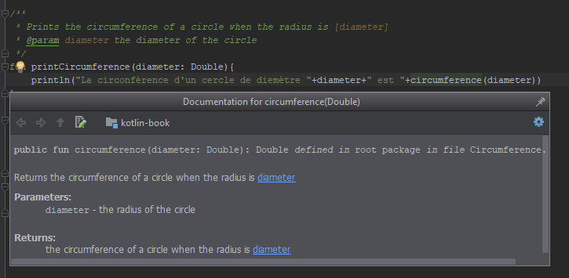

# Chapter 2<br />Variables, Types, Constants, and Operators

## Definition of a Variable

A variable is a value paired with an associated symbolic name. If you’ve used mathematics before, you have already used variables. When you are asked to give the formula of the circumference of a circle, you answer π times diameter. When you say that, you associate the *diameter* word with a value.

### Variable Types

In computer programming, a value is a storage location. So you will have to make the best use of the storage location in order to optimize the performance of an application.

Let’s say that you want to make a quiz in which you let the user guess a number between 1 and 100. The number may be stored on one byte (28, so 256 possible values). So you will associate this number to a value that can be stored on one byte, which optimizes the amount of memory consumed by your application.

Now, let’s say you would like to associate each person in a group to a number, and let’s say there are 2,500 to 3,000 people to this group. You will easily guess you can not store each person’s number on one byte without running out of storage. You will need a type that can store more data.

#### Numbers

That is why Kotlin comes with 8 variable types in which you can store numbers:

* `Byte`: a value from -128 to +127 stored on one byte
* `Short`: a value from -32,768 to +32,767 stored on two bytes
* `Int`: a value from -231 to +231-1 stored on four bytes
* `Long`: a value from -263 to +263-1 stored on eight bytes
* `Float`: a value stored on sixteen bytes in which you can store more precise decimal numbers
* `Double`: a value stored on thirty-two bytes in which you can store the most precise decimal numbers

Be careful: `Float` and `Double` must always be considered approximate values (with `Double` being more precise) but never as exact values.

#### Characters

That is OK for numbers, but you may also want to store characters in variables. A character is a sign that can be printed to the screen, such as a letter, a tab, a line break, or a punctuation mark.

* `Char`: a value to store characters stored on two bytes

#### Boolean

Finally, the boolean type can store only two values: true and false.

* `Boolean`: a type with which to store a binary value, stored on a very small undefined amount of memory (less than or equal to one byte).

#### Object

Variables can also store object instances. But object-oriented programming will be covered later in this book.

### Notation

To define a variable in Kotlin we use the `var` keyword, followed by the name of the variable, a colon, its type, the `=` sign, and its value. This is called a mutable variable because its value may change.

So, the definition of a `Double` variable named `diameter` would be written as follows:

```kotlin
var diameter: Double = 3.78
```

## Definition of an Immutable Variable

An immutable variable is a variable for which the value will not change. You initialize its value, and then you cannot edit it. If you try to edit the value of an immutable variable, the compiler will not compile your program.

Aside from the fact that its value cannot be edited, everything that has been said about mutable variables is also true about immutable variables.

### Notation

To define an immutable variable in Kotlin, we use the same notation we do for mutable variables—except for the `var` keyword, which becomes `val`.

```kotlin
val pi: Double = 3.14
```

## Definition of a Constant

A constant is an identifier that will be replaced by its value by the preprocessor of the compiler, before the compiling begins.

So far, we have seen all steps from source code to final result, including compilation.

Right before compilation, there is a preprocessor that will edit your source code. This preprocessor will replace all constant identifiers with their values.

This means you can only define a constant value with an explicit value. You cannot set to a constant the value returned by a function (we will see that later in this chapter) but only a number or a string…

In order to produce a cleaner code, it is preferable to use a constant. However:

* If it is not possible to use a constant, then use an immutable variable.
* If it is not possible to use an immutable variable, then use a mutable variable.

### Notation

The notation used to define a constant in Kotlin is the same as it is for an immutable variable, except that the `val` keyword is preceded by the `const` keyword.

```kotlin
const val PI: Double = 3.14
```

## Definition of an Argument

An argument is a variable passed to a function so the function can interact with it. For example, when we develop a function to calculate the circumference of a circle, we need to know the diameter of the circle. This value may be passed as an argument to the function.

### Notation

<p class="pageBreakAfter">An argument is written between two parentheses in the definition of a function. We write the name of the argument, followed by a colon, followed by its type. A function that will calculate the circumference of a circle will be written as follows:</p>

```kotlin
fun circumference(diameter: Double){

}
```

That is how you write a function with one argument. But you may pass more arguments to a single function. If you do this, arguments must be separated by a comma. So if we write a function calculating the perimeter of a rectangle, we will have to use the height and the width as arguments. Therefore, the function will be written as follows:

```kotlin
fun rectanglePerimeter(width: Double, height: Double){

}
```

## Return Value of a Function

A function may return a value. In our first **Hello, World!** sample, the `main` function did not return a value. But if we write a function calculating the circumference of a circle, we may want the function to return the value of the circumference. To specify that a function should return a value, right after closing the parentheses, we add a semicolon and then its type. So a function calculating the circumference of a circle will  be written as follows:

```kotlin
fun circumference(diameter: Double): Double{

}
```

A function can return only one value, and that value can only be of one specified type.

Of course, you can assign the return value of a function to a variable. This will be written as follows:

```kotlin
val diameter : Double = 3.78
val circumference : Double = circumference(diameter)
```

## Implicit Types and Literals

We just saw how to define a variable:

```kotlin
val someValue: Int = 4
```

In that specific case, we don’t have to specify the `Int` variable type. We can simply write it as follows:

```kotlin
val someValue = 4
```

This notation is correct and is equivalent to the first one. Be careful: even if the type is not explicitly set, 4 is still an `Int` value. To be sure that this is the case, you may write the following program:

<div class="fileTitle">TypeError.kt</div>

```kotlin
fun main(args: Array<String>) {
   var someValue = 4
   someValue = 5.56
   println(someValue)
}
```

When you try to compile the program, you will get the following error:

<pre class="terminal"><code class="terminal">TypeError.kt:3:17: error: the floating-point literal does not conform to the expected type Int
    someValue = 5.56
                ^</code></pre>

Kotlin tells you that it can not set a decimal number to a variable of type `Int`.

So, which type will be set to a variable when we do not explicitly specify its type?

We can find out by writing another little Kotlin program:

<div class="fileTitle">VarTypes.kt</div>

```kotlin
fun main(args: Array<String>) {
   val someValue = 4
   val someValue2 = 4.56
   val someValue3 = 'c'

   println(someValue.javaClass.kotlin.qualifiedName)
   println(someValue2.javaClass.kotlin.qualifiedName)
   println(someValue3.javaClass.kotlin.qualifiedName)
}
```

<p style="text-align:center;"><i>This program uses parts of Kotlin that we will see later in this book. Just copy and paste this code as it is; it is not really important that you understand everything about it right now.</i></p>

When compiling and then running the program, we get the following result:

<pre class="terminal"><code class="terminal">kotlin.Int
kotlin.Double
kotlin.Char</code></pre>

So we now know that, when we write an integer number, the `Int` type will be set. When we write a decimal number, the `Double` type will be set; and when we write a character in single quotes, the `Char` type will be set.

But how do we indicate that a variable is of the `Float` type or the `Long` type without specifying its type explicitly?

We may use a character at the end of the value to specify the type of variable it is:

<div class="fileTitle">VarTypesFull.kt</div>

```kotlin
fun main(args: Array<String>) {
   val someValue = 4
   val someValue2 = 4L
   val someValue3 = 4.56
   val someValue4 = 4.56F
   val someValue5 = 'c'

   println(someValue.javaClass.kotlin.qualifiedName)
   println(someValue2.javaClass.kotlin.qualifiedName)
   println(someValue3.javaClass.kotlin.qualifiedName)
   println(someValue4.javaClass.kotlin.qualifiedName)
   println(someValue5.javaClass.kotlin.qualifiedName)
}
```

When compiling and then running this program, we get the following result:

<pre class="terminal"><code class="terminal">kotlin.Int
kotlin.Long
kotlin.Double
kotlin.Float
kotlin.Char</code></pre>

So what we see here is that by adding an `L` to the end of an integer number, we set its type to `Long`. By adding an `F` to the end of a decimal number, we set its type to `Float`. These are the only two types for which we are able to use those shortcuts.

To define a variable as `Short` or `Byte`, we need to use the explicit definition.

## Integers Notation

<p class="pageBreakAfter">In order to produce a more readable and/or comprehensive code, you may use some different notations for integers.</p>

### Underscores

For very large numbers, you may use underscores to separate digits by groups in a number. This helps make the number more readable.

```kotlin
val complexGigaByte = 1073741824
val readableGigaByte = 1_073_741_824
```

Both declarations are equivalent, but you may notice that the second one is more readable than the first.

### Binary Notation

Sometimes, you may want to write a number using its binary notation. It’s possible to do this by adding the 0b prefix to the number. Underscores may also be used:

```kotlin
val readableGigaByte = 1_073_741_824
val binaryGigaByte = 0b1000_0000_0000_0000_0000_0000_0000_000‬
```

Both declarations are equivalent.

### Hexadecimal Notation

You may also want to write numbers using their hexadecimal notation. It is possible to do this by adding the 0x prefix to those numbers:

```kotlin
val readableGigaByte = 1_073_741_824
val hexadecimalGigaByte = 0x4000_0000‬
```

## Operators

### Assignment

This is the only operator we have already used. You can use an `=` sign to assign a value to a variable:

<pre class="pageBreakAfter"><code class="lang-kotlin">val three = 3</code></pre>

### Mathematical Operators

It is possible to use mathematical operators between two numeric values or variables:

<div class="fileTitle">Operators.kt</div>

```kotlin
fun main(args: Array<String>) {
   val add = 2_000_000_000+2_000_000_000
   val multiply = 3*7
   val subtract = 7-4
   val divide = 7/3
   val modulo = 7%3

   println(add)
   println(multiply)
   println(subtract)
   println(divide)
   println(modulo)
}
```

<p style="text-align:center"><i>The modulo operation returns the remainder in the euclidean division.</i></p>

When compiling and then running this program, we get the following result:

<pre class="terminal"><code class="terminal">-294967296
21
3
2
1</code></pre>

As you can see, the sum of two billions plus two billions produces a negative result. You may also notice that the result of 7/3 is 2. This is because an operation between two variables of the same type produces a result of the same type. Here, an addition of two `Int`, or a division between two `Int`, produces an `Int`.

Now we understand why 7/3 returns 2 but not why the sum is producing a negative result. We already said that an `Int` cannot store a value higher than 2<sup>31</sup>-1, or 2,147,483,647. If we are going above this value, nothing reliable can be expected from an `Int` variable.

So what about operations between two different types? The type stored on more bytes will be the type of the result. The only exception is the `Char` type, which will still be a `Char` even if we add a value that is stored on more bytes. So, to get the expected result, we can write the following program:

<div class="fileTitle pageBreakBefore">OperatorsCorrect.kt</div>

```kotlin
fun main(args: Array<String>) {
   val byte:Byte = 7
   val short:Short = 5

   val add = 2_000_000_000+2_000_000_000L
   val multiply = 3*7
   val subtract = 7-4
   val divide = 7/3.0
   val modulo = 7%3
   val add2 = byte+2_000_000_000
   val add3 = short+2_000_000_000
   val add4 = 'c'+3

   println(add)
   println(multiply)
   println(subtract)
   println(divide)
   println(modulo)
   println(add2)
   println(add3)
   println(add4)
}
```

When compiling and then running the program, we get the following result:

<pre class="terminal"><code class="terminal">4000000000
21
3
2.3333333333333335
1
2000000007
2000000005
f</code></pre>

### Augmented Assignments

You may need to write the following code:

```kotlin
var value = 3
value = value + 10
value = value - 1
value = value / 3
value = value * 4
value = value % 5
```

When the variable is both the assigned value and the first part of a mathematical operation, you can write the code as follows:

```kotlin
var value = 3
value += 10
value -= 1
value /= 3
value *= 4
value %= 5
```

The two codes are equivalent.

### About Strings

You may use the `+` sign in a string to concatenate the result:

```kotlin
val HelloWorld100 = "Hello "+"World! "+100;
```

The value of the `HelloWorld100` variable is now `"Hello World! 100"`.

## Let’s Practice

In your text editor, open a new file that you will name `Circumference.kt`:

<div class="fileTitle">Circumference.kt</div>

```kotlin
fun main(args: Array<String>) {
   var diameter: Double = 3.78
   var circumference = circumference(diameter)
   println(circumference)
   diameter = 1.72
   circumference = circumference(diameter)
   println(circumference)
}

fun circumference(diameter: Double): Double{
   return 3.14*diameter
}
```

This program returns the circumference of a circle regarding its diameter. When you compile and then run this program, you will get the following result:

<pre class="terminal"><code class="terminal">47.4768
22.2312</code></pre>

We could be happy with that, but there is just one little thing missing.

## Code Cleaning

The content of the `main` function is difficult to approach. It needs to be read line by line to clearly understand what it does. But it is possible to make things more clear.

### Comments

You may add comments to your code. Comments are a part of code that the compiler will ignore but that may help with the readability of the program.

#### Single-Line Comments

To write a comment on a single line, you have to add `//`. Everything after that on the line will be ignored by the compiler, except `//`, which is included in a string.

```kotlin
var diameter: Double = 3.78 // diameter is now 3.78
println("I am displayed // me too") // but I am not
```

#### Blocks of Comments

It is also possible to write comments on two or more lines. The comment needs to start with `/*` and to end with `*/`:

```kotlin
/*Calculate the circumference of a circle.
The formula in use is pi*diameter
This is much more clear*/
circumference = circumference(diameter)
```

#### KDoc

KDoc is a special form of comment that is placed before a block and provides details about this block. The advantage with KDoc is that it is known and used by all, so generating or accessing documentation is easier in this format.

<p class="pageBreakAfter">We could spend a full chapter on KDoc. But for now we’ll take a look at some examples, and then you will become more comfortable with KDoc as you read this book.</p>

```kotlin
/**
* Returns the circumference of a circle when diameter is [diameter].
* @param diameter the diameter of the circle
* @return the circumference of a circle when diameter is [diameter]
*/
fun circumference(diameter: Double): Double{
   return 3.14*diameter
}
```

The KDoc block here lets the reader clearly understand what the function does and how arguments are used.

<p></p>

<p style="text-align:center"><i>Exemple d’affichage d’une boîte d’aide sur le rôle d’une fonction pour laquelle une documentation au format KDoc a été rédigée dans Android Studio.</i></p>

### English Language

This book was originally written in French. In the French version, all of the programs are written in English. So regardless of your native tongue, there are a few good reasons to write your programs in English:

* All Kotlin functions are in English, just like the `println` function we used. Writing your code in English will keep you from getting lost between two different languages in your code; it will also preserve homogeneity in your code.
* You will use a lot of English websites to ask questions about parts of your code, and you’ll also use English websites to copy/paste available code. Again, keeping everything in English will keep you from getting lost and will help people who would like to answer your questions to better understand you.
* Finally, variable identifiers and functions cannot be written using special characters. You can not use the French “é”, Spanish “ñ”, or German “ö” in identifiers. Because English doesn’t have special characters, keeping everything in English will let you write without making spelling errors.

<h3 class="pageBreakBefore">Code Refactoring</h3>

As you can see, we repeat the same things two times in our code:

* diameter = value
* circumference = returnValueOfFunction
* display circumference

The problem when duplicating code is that when we want to edit it, fix bugs, or improve it, we will need to do it twice.

### Constants

In order to make the code more readable, it is better to take out direct values from the code and to put it into constants instead.

This is mainly because you may make a mistake when typing a string or a number in your code. If you do so, the code may be very difficult to fix (especially with huge projects).

Using constants will make things easier because if you make a mistake writing the name of a constant, the compiler simply won’t compile. Instead it will display an error message showing you exactly where the error is.

In order to differentiate constants and variables, we often write the constants’ names in uppercase letters.

## Let’s Practice Again

By following the above advice, we get the following code:

<div class="fileTitle pageBreakBefore">Circumference.kt</div>

```kotlin
/** The value of π for calculating the circumference */
const val PI: Double = 3.14

/**
 * Main method, displaying the circumference of two circles
 */
fun main(args: Array<String>) {
   printCircumference(3.78)
   printCircumference(1.72)
}

/**
 * Prints the circumference of circle when diameter is [diameter]
 * @param diameter the diameter of circle
 */
fun printCircumference(diameter: Double){
   println(circumference(diameter))
}

/**
 * Returns the circumference of circle when diameter is [diameter]
 * @param diameter the diameter of circle
 * @return the circumference of a circle when diameter is [diameter]
 */
fun circumference(diameter: Double): Double{
   return PI*diameter
}
```

This makes the code easier to read and maintain. Let’s say that you now want to display `"circumference("+diameter+")="+circumference(diameter)`. You will have to edit only one part of your code:

<div class="fileTitle">Circumference.kt</div>

```kotlin
/**
 * Prints the circumference of a circle when the diameter is [diameter]
 * @param diameter the circumference of the circle
 */
fun printCircumference(diameter: Double){
   println("circumference("+diameter+")="+circumference(diameter))
}
```

<p class="pageBreakAfter">Code refactoring lets us edit just one part of the code to update two displays.</p>

## Exercises

### Exercise 1 - Easy

Develop a program equivalent to the one we just developed but which will calculate the perimeter of a square using the length of its side.

### Exercise 2 - Easy

Develop a program that, from the values 13 and 5, will display `"13/5 = 2 and the remainder is 3"`.
