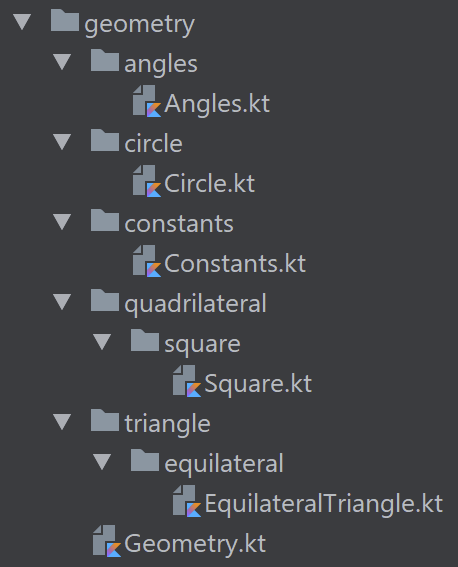

# Chapter 3<br />Multiple Sources, Packages, and Imports

*In this chapter, some definitions will be <span class="highlightDefinition">highlighted</span> because they are incomplete or too imprecise. This is because you would need object-oriented programming knowledge to understand the exact definition. Object-oriented programming will be covered in the next chapter.*

By now, you know how to develop functions with variables. So you may want to develop huge programs. You’re now able, for example, to develop a project which calculates the perimeters and areas of all possible plane shapes.

Just imagine: quadrilaterals, circles, triangles... and why not pentagons, hexagons, or dodecagons? So source code would become very long and, therefore, would have at least two inconvenient aspects:

* First, it would become very complex to maintain a large amount of source code in a single file.
* Second, if your program starts becoming too large, issues with loading can happen because your computer needs to load all of the functions you developed.

That is exactly why Kotlin provides import and package features to remedy these issues.

## Multiple Sources

We will write a program similar to the one we developed in the previous project except that it will be separated into two files:

* The first will contain display functions of the program.
* The second will contain circle calculation functions.

<p class="pageBreakAfter">Let’s begin:</p>

<div class="fileTitle">Geometry.kt</div>

```kotlin
/**
 * Main method, displaying the circumference of two circles
 */
fun main(args: Array<String>) {
   printCircumference(3.78)
   printCircumference(1.72)
}

/**
 * Prints the circumference of a circle when the diameter is [diameter]
 * @param diameter the circumference of the circle
 */
fun printCircumference(diameter: Double){
   println("circumference("+diameter+")="+circumference(diameter))
}
```

<div class="fileTitle">Circle.kt</div>

```kotlin
/** The value of π for calculating the circumference of a circle */
const val PI: Double = 3.14

/**
 * Returns the circumference of a circle when the diameter is [diameter]
 * @param diameter the diameter of the circle
 * @return the circumference of a circle when the diameter is [diameter]
 */
fun circumference(diameter: Double): Double{
   return PI*diameter
}
```

Now, execute the following command:

<pre class="terminal"><code class="terminal">kotlinc Geometry.kt Circle.kt -d ./build</code></pre>

The `-d` argument, which you’ll know if you completed the exercises from Chapter 1, allows us to create a folder in which the binary files will be stored.

This allows us to avoid mixing source files and binary files, which will become important when we start to work with projects containing multiple files.

To run the program, you just need to execute the following command:

<pre class="terminal"><code class="terminal">kotlin -cp ./build GeometryKt</code></pre>

<span class="highlightDefinition">The <code>-cp</code> argument lets the Kotlin compiler know in which directory it should look for binaries.</span>

You can see that two `.class` binary files have been created. <span class="highlightDefinition">So, we know that Kotlin separated our source files.</span>

### Packages

We’ve seen how to compile a program to determine which sources are in separated files. But it is possible to do more.

Here, the `PI` constant has been added to a file calculating the circumference of a circle. Imagine now that we would like to give our program the ability to convert angles measured in radians to degrees, and vice versa. We will need the `PI` constant for angle calculations as well.

This will force us to create four files in order to not duplicate code as seen in the previous chapter.

<div class="fileTitle">Geometry.kt</div>

```kotlin
/**
 * Main method, displaying the circumference of two circles
 */
fun main(args: Array<String>) {
   printCircumference(3.78)
   printAngleDeg(PI)
}

/**
 * Prints the circumference of a circle when the diameter is [diameter]
 * @param diameter the circumference of the circle
 */
fun printCircumference(diameter: Double){
   println("circumference("+diameter+")="+circumference(diameter))
}

/**
 * Prints the conversion of an angle measured in radian to
 */
fun printAngleDeg(angRad: Double){
   println("toDegrees("+angRad+")="+toDegrees(angRad))
}
```

<div class="fileTitle pageBreakBefore">Circle.kt</div>

```kotlin
/**
 * Returns the circumference of a circle when the diameter is [diameter]
 * @param diameter the diameter of the circle
 * @return the circumference of a circle when the diameter is [diameter]
 */
fun circumference(diameter: Double): Double{
   return PI*diameter
}
```

<div class="fileTitle">Angle.kt</div>

```kotlin
/** Flat angle measured in degrees */
const val DEGREES_FLAT_ANGLE = 180
/** Flat angle measured in radians */
const val RADIANS_FLAT_ANGLE = PI

/**
 * Converts an angle measured in radians to an equivalent angle measured in degrees.
 * @param angrad an angle, in radians
 * @return the measurement of the angle [angrad] in degrees
 */
fun toDegrees(angrad: Double): Double{
   return angrad/RADIANS_FLAT_ANGLE*DEGREES_FLAT_ANGLE
}

/**
 * Converts an angle measured in degrees to an equivalent angle measured in radians.
 * @param angdeg an angle, in degrees
 * @return the measurement of the angle [angdeg] in radians
 */
fun toRadians(angdeg: Double): Double{
   return angdeg/DEGREES_FLAT_ANGLE*RADIANS_FLAT_ANGLE
}
```

<div class="fileTitle">Constants.kt</div>

```kotlin
/** The value of π for calculating the circumference of a circle */
const val PI: Double = 3.14
```

In this example, we only have four files. But sometimes a project may contains hundreds or even thousands of files. So we do not want to add each file to the compile command.

<pre class="terminal"><code class="terminal">kotlinc ./* -d build</code></pre>

The program compiles and runs well. Everything is fine.

Now, imagine we add two more files to our project, one to calculate the perimeter of a square and another to calculate the perimeter of an equilateral triangle.

<div class="fileTitle">Square.kt</div>

```kotlin
/**
 * Returns the perimeter of a square when the length of a side is [sideLength]
 * @param sideLength the length of a side of the square
 * @return the perimeter of a square when the length of a side is [sideLength]
 */
fun perimeter(sideLength: Double): Double{
   return 4*sideLength
}
```

<div class="fileTitle">EquilateralTriangle.kt</div>

```kotlin
/**
 * Returns the perimeter of an equilateral triangle when the length of a side is [sideLength]
 * @param sideLength the length of a side of the equilateral triangle
 * @return the perimeter of an equilateral triangle when the length of a side is [sideLength]
 */
fun perimeter(sideLength: Double): Double{
   return 3*sideLength
}
```

Once more, let’s compile our program:

*macOS and Linux :*
<pre class="terminal"><code class="terminal">rm -rf ./build/* && kotlinc ./* -d build</code></pre>

*Windows :*
<pre class="terminal"><code class="terminal">del /S/Q build && kotlinc ./* -d build</code></pre>

Now we get an error:

<pre class="terminal"><code class="terminal">EquilateralTriangle.kt:6:1: error: conflicting overloads: public fun perimeter(sideLength: Double): Double defined in root package in file EquilateralTriangle.kt, public fun perimeter(sideLength: Double): Double defined in root package in file Square.kt
fun perimeter(sideLength: Double): Double{
^
Square.kt:6:1: error: conflicting overloads: public fun perimeter(sideLength: Double): Double defined in root package in file EquilateralTriangle.kt, public fun perimeter(sideLength: Double): Double defined in root package in file Square.kt
fun perimeter(sideLength: Double): Double{
^</code></pre>

Actually, the problem is that the `perimeter(Double)` function is defined two times. And it would be a mistake to rename our functions to solve the problem, as their names are pretty clear.

<span class="highlightDefinition">To solve this problem, Kotlin allows us to separate source files into packages.</span> So if a function is defined in two different packages, Kotlin will consider them to be distinct functions.

To specify that a source file is part of a package, you just have to add the `package` keyword—followed by the name of the package you would like to set—on the first line of the file.

Furthermore, in order to have a hierarchy of packages, each package can have subpackages. You just need to separate them with a dot. So, `geometry.angles` and `geometry.circles` are two packages (`angles` and `circles`) that are parts of the `geometry` package.

So, the first line of each file becomes:

<div class="fileTitle">Geometry.kt</div>

```kotlin
package geometry
```

<div class="fileTitle">Circle.kt</div>

```kotlin
package geometry.circle
```

<div class="fileTitle">Angle.kt</div>

```kotlin
package geometry.angles
```

<div class="fileTitle">Constants.kt</div>

```kotlin
package geometry.constants
```

<div class="fileTitle">Square.kt</div>

```kotlin
package geometry.quadrilateral.square
```

<div class="fileTitle">EquilateralTriangle.kt</div>

```kotlin
package geometry.triangle.equilateral
```

<p class="pageBreakAfter">Now, we just need to compile our program. Let’s try.</p>

*macOS and Linux :*
<pre class="terminal"><code class="terminal">rm -rf ./build/* && kotlinc ./* -d build</code></pre>

*Windows :*
<pre class="terminal"><code class="terminal">del /S/Q build && kotlinc ./* -d build</code></pre>

We now get many errors. The problem is that the Kotlin compiler cannot find the `circumference` function or any other reference. Why can’t it find them?

If we do not specify which package a file should go in, Kotlin will automatically add our files to the original root package. So, before specifying packages, Kotlin considered all files to be part of the same package. And when calling a function, Kotlin will automatically look for it in the package of the file calling the function.

Now, when calling `printAngleDeg(PI)` in `Geometry.kt`, Kotlin will not try to find it in the root package. Instead, it will look for it in the `geometry` package that we specified for this file. But the `PI` constant is in a different package, so it cannot find the definition of this constant.

So in order for Kotlin to find our `PI` constant, we need to tell it in which package the constant can be found. To do so, we have to write the package name, followed by a dot, followed by `PI`. So `PI` now becomes `geometry.constants.PI`.

Now the code in our files becomes:

<div class="fileTitle pageBreakBefore">Geometry.kt</div>

```kotlin
package geometry

/**
 * Main method, displaying the circumference of two circles
 */
fun main(args: Array<String>) {
   printCircumference(3.78)
   printAngleDeg(geometry.constants.PI)
}

/**
 * Prints the circumference of a circle when the diameter is [diameter]
 * @param diameter the circumference of the circle
 */
fun printCircumference(diameter: Double){
   println("circumference("+diameter+")="+geometry.circle.circumference(diameter))
}

/**
 * Prints the conversion of an angle measured in radian to
 */
fun printAngleDeg(angRad: Double){
   println("toDegrees("+angRad+")="+geometry.angles.toDegrees(angRad))
}
```

<div class="fileTitle pageBreakBefore">Angles.kt</div>

```kotlin
package geometry.angles

/** Flat angle measured in degrees */
const val DEGREES_FLAT_ANGLE = 180
/** Flat angle measured in radians */
const val RADIANS_FLAT_ANGLE = geometry.constants.PI

/**
 * Converts an angle measured in radians to an equivalent angle measured in degrees.
 * @param angrad an angle, in radians
 * @return the measurement of the angle [angrad] in degrees
 */
fun toDegrees(angrad: Double): Double{
   return angrad/RADIANS_FLAT_ANGLE*DEGREES_FLAT_ANGLE
}

/**
 * Converts an angle measured in degrees to an equivalent angle measured in radians.
 * @param angdeg an angle, in degrees
 * @return the measurement of the angle [angdeg] in radians
 */
fun toRadians(angdeg: Double): Double{
   return angdeg/DEGREES_FLAT_ANGLE*RADIANS_FLAT_ANGLE
}
```

<div class="fileTitle">Circle.kt</div>

```kotlin
package geometry.circle

/**
 * Returns the circumference of a circle when the diameter is [diameter]
 * @param diameter the diameter of the circle
 * @return the circumference of a circle when the diameter is [diameter]
 */
fun circumference(diameter: Double): Double{
   return geometry.constants.PI*diameter
}
```

We can now compile the program (no suspense anymore: it works). Then we can run it:

<pre class="terminal"><code class="terminal">kotlin -cp build GeometryKt</code></pre>

This time, an error occurs when we try to run the program:

<pre class="terminal"><code class="terminal">error: could not find or load main class GeometryKt</code></pre>

Just like for source files, <span class="highlightDefinition">Kotlin will look for the binary file <code>GeomtryKt</code></span> in the root package when calling `GeometryKt`. But there is now a package assigned to the `Geometry.kt` file. So we just have to tell Kotlin the package in which it can find `GeometryKt`:

<pre class="terminal"><code class="terminal">kotlin -cp build geometry.GeometryKt</code></pre>

What we have to do now is edit the `Geometry.kt` file in order to add a call to the two functions we developed:

<div class="fileTitle pageBreakBefore">Geometry.kt</div>

```kotlin
package geometry

/**
 * Main method, displaying the circumference of two circles
 */
fun main(args: Array<String>) {
   printCircumference(3.78)
   printAngleDeg(geometry.constants.PI)
   printEquilateralTrianglePerimeter(3.0)
   printSquarePerimeter(3.0)
}

/**
 * Prints the circumference of a circle when the diameter is [diameter]
 * @param diameter the circumference of the circle
 */
fun printCircumference(diameter: Double){
   println("circumference("+diameter+")="+geometry.circle.circumference(diameter))
}

/**
 * Prints the conversion of an angle measured in radian to
 */
fun printAngleDeg(angRad: Double) {
   println("toDegrees(" + angRad + ")=" + geometry.angles.toDegrees(angRad))
}

/**
 * Prints the perimeter of an equilateral triangle when the length of a side is [sideLength]
 * @param sideLength the length of a side of the equilateral triangle
 */
fun printEquilateralTrianglePerimeter(sideLength: Double){
   println("Equilateral triangle perimeter(" + sideLength + ")=" + geometry.triangle.equilateral.perimeter(sideLength))
}

/**
 * Prints the perimeter of a square when the length of a side is [sideLength]
 * @param sideLength the length of a side of the square
 */
fun printSquarePerimeter(sideLength: Double){
   println("Square perimeter(" + sideLength + ")=" + geometry.quadrilateral.square.perimeter(sideLength))
}
```

### File Tree Convention

With all files in the same directory, it is difficult to know which file is part of which package at a glance.

Furthermore, it is easy to compare the hierarchy of a package using folders constructed to reflect the same hierarchy.

So the approach used most often by developers is to organize source files of a project so each package is associated with a directory, and each source file is in the directory associated with its package.

For our current project, we can use the following file tree:

<p></p>

The command remains the same to compile the project:

*macOS and Linux :*
<pre class="terminal"><code class="terminal">rm -rf ./build/* && kotlinc ./* -d build</code></pre>

*Windows :*
<pre class="terminal"><code class="terminal">del /S/Q build && kotlinc ./* -d build</code></pre>

## Imports

Just like in the `Geometry.kt` file, in order to calculate circumference of a circle, we need to call the `geometry.circle.circumference()` function.

As we saw in the second chapter, it is better to keep the code as simple and compact as possible. Imagine if we had to call `geometry.circle.circumference()` each time: it is neither simple nor compact.

<p class="pageBreakAfter">In order to address this issue, Kotlin allows us to use imports. An import allows us to specify the complete path to a function in a file. Here is an example using <code>Geometry.kt</code>:</p>

```kotlin
package geometry

import geometry.circle.circumference


// ...
fun printCircumference(diameter: Double){
   println("circumference("+diameter+")="+circumference(diameter))
}
// ...
```

<p class="text-align:center;"><i>The <code>//...</code> notation here lets you know that there is some code here that hasn’t been printed. This allows you to focus only on a part of the code. Here, only what has changed in Geometry.kt has been displayed; since everything else remained the same, it has been simplified with the <code>//...</code> notation.</i></p>

So we can easily see here how imports make things easier.

### Star

Now, let’s look at the example of angles and two functions associated with each one. We could write the following import statements:

```kotlin
import geometry.angles.toDegrees
import geometry.angles.toRadians
```

But Kotlin provides a way to import everything in a package: the `*` notation. So in order to import all functions in the `geometry.angles` package, we could use:

```kotlin
import geometry.angles.*
```

So both functions can now be called in their short form in the code.

Although it is possible, we strongly discourage you from using this notation for two main reasons:

* Even if you call everything in a package today, you may add functions to the package tomorrow. This would make the import useless and create a loss in terms of performance.
* It is difficult to keep track of what is imported and why, which makes the code more complex to read.

So, in most cases, it is better to use full imports and avoid ones that use the star notation. However, it is still important to know what the star notation stands for when you encounter it in code.

<h3 class="pageBreakBefore">Limitations</h3>

It is not possible to import two packages containing functions with the same name. So it is not possible to use the following imports:

```kotlin
import geometry.quadrilateral.square.perimeter
import geometry.triangle.equilateral.perimeter
```

The reason is the same as the one that motivates us to use packages. If we use both imports, the compiler will not know which `perimeter` function to use when calling it.

## Exercises

### Exercise 1 - Easy

Simplify all function calls to make them appear in their short forms. As discussed earlier, only `perimeter` functions should not be simplified.

### Exercise 2 - Medium

If you understood this chapter well, it will be possible for you to simplify one call to a `perimeter` function. So simplify one call to this function.
