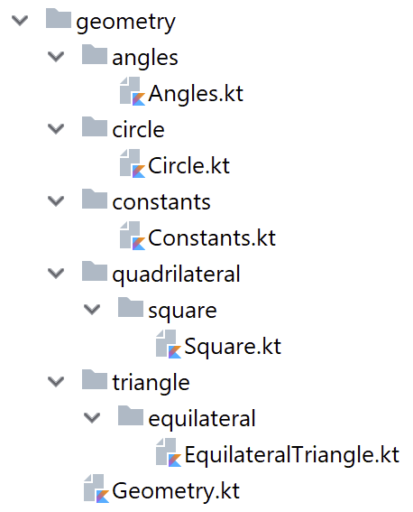
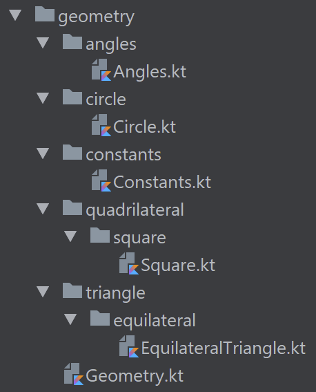

# Chapitre 3<br />Sources multiples, paquets et imports

*Dans ce chapitre, certaines définitions seront <span class="highlightDefinition">surlignées</span>, étant incomplètes ou trop imprécises quant à la notion de programmation orientée objets, abordée dans le chapitre suivant.*

Jusque-là, nous avons vu comment développer des fonctions, avec des variables. Dès lors, vous pourriez avoir envie de développer de gros programmes. Rien ne vous empêche par exemple de développer un projet qui calcule la circonférence et l’aire de toutes les formes géométriques possibles.

Imaginez un peu, les quadrilatères, les cercles, les triangles, pourquoi pas les pentagones et les hexagones tant qu’on y est, jusqu’au dodécagone. Bref, le code source de votre programme deviendrait très volumineux, et aurait donc deux inconvénients principaux :

* Le premier, il serait complexe de maintenir un code source d’un énorme volume dans un seul fichier source ;
* Le second, si votre programme commence à devenir très important, cela pourrait occasionner des problèmes de chargement, le temps que l’ordinateur soit capable de charger l’intégralité des fonctions que vous avez développées.

<p><span class="highlightDefinition">C’est pour résoudre cette problématique que Kotlin offre l’avantage d’avoir un système de paquets et d’imports très pratique.</span></p>

## Sources multiples

Nous allons écrire un programme, semblable à celui développé dans le projet précédent, mais séparé en deux fichiers :

* L’un contiendra les fonctions d’affichage du programme ;
* L’autre contiendra les fonctions relatives au calcul sur un cercle.

<p class="pageBreakAfter">C’est parti :</p>

<div class="fileTitle">Geometry.kt</div>

```kotlin
/**
 * Main method, displaying the circumference of two circles
 */
fun main(args: Array<String>) {
   printCircumference(3.78)
   printCircumference(1.72)
}

/**
 * Prints the circumference of a circle when the diameter is [diameter]
 * @param diameter the circumference of the circle
 */
fun printCircumference(diameter: Double){
   println("circumference("+diameter+")="+circumference(diameter))
}
```

<div class="fileTitle">Circle.kt</div>

```kotlin
/** The value of π for calculating the circumference of a circle */
const val PI: Double = 3.14

/**
 * Returns the circumference of a circle when the diameter is [diameter]
 * @param diameter the diameter of the circle
 * @return the circumference of a circle when the diameter is [diameter]
 */
fun circumference(diameter: Double): Double{
   return PI*diameter
}
```

Maintenant exécutez la commande suivante :

<pre class="terminal"><code class="terminal">kotlinc Geometry.kt Circle.kt -d ./build</code></pre>

L’argument `-d` que vous connaissez surement, si vous avez résolu les exercices du chapitre󠄃󠆏 1, permet de créer un répertoire dans lequel seront stockés les fichiers exécutables.
Cela permet de ne pas mélanger les fichiers sources et les fichiers exécutables, ce qui devient très important lorsque l’on travaille avec des projets sur plusieurs fichiers.

Pour exécuter le programme, il suffit d’exécuter la commande suivante :

<pre class="terminal"><code class="terminal">kotlin -cp ./build GeometryKt</code></pre>

<span class="highlightDefinition">L’argument `-cp` permet d’indiquer au l’exécuteur kotlin dans quel répertoire chercher nos fichiers exécutables.</span>

Vous pourrez observer dans le dossier build, que deux fichiers exécutables .class ont été créés. <span class="highlightDefinition">Ainsi, nous pouvons en déduire que le compilateur Kotlin a bien séparé nos fichiers source.</span>

## Paquets

Nous avons vu comment compiler un programme dans lequel les sources sont dans des fichiers séparés. Mais nous pourrions aller plus loin.

Ici, la constante `PI` a été ajoutée dans le fichier calculant la circonférence d’un cercle. Imaginons maintenant que nous souhaitions ajouter à notre programme la possibilité pour des angles exprimés en degrés de les convertir en radians, et vice versa. Nous aurons également besoin de cette valeur pour les angles.

Cela nous obligera à avoir quatre fichiers, afin de ne pas dupliquer de codes comme vu dans le chapitre précédent :

<div class="fileTitle">Geometry.kt</div>

```kotlin
/**
 * Main method, displaying the circumference of two circles
 */
fun main(args: Array<String>) {
   printCircumference(3.78)
   printAngleDeg(PI)
}

/**
 * Prints the circumference of a circle when the diameter is [diameter]
 * @param diameter the circumference of the circle
 */
fun printCircumference(diameter: Double){
   println("circumference("+diameter+")="+circumference(diameter))
}

/**
 * Prints the conversion of an angle measured in radian to
 */
fun printAngleDeg(angRad: Double){
   println("toDegrees("+angRad+")="+toDegrees(angRad))
}
```

<div class="fileTitle pageBreakBefore">Circle.kt</div>

```kotlin
/**
 * Returns the circumference of a circle when the diameter is [diameter]
 * @param diameter the diameter of the circle
 * @return the circumference of a circle when the diameter is [diameter]
 */
fun circumference(diameter: Double): Double{
   return PI*diameter
}
```

<div class="fileTitle">Angle.kt</div>

```kotlin
/** Flat angle measured in degrees */
const val DEGREES_FLAT_ANGLE = 180
/** Flat angle measured in radians */
const val RADIANS_FLAT_ANGLE = PI

/**
 * Converts an angle measured in radians to an equivalent angle measured in degrees.
 * @param angrad an angle, in radians
 * @return the measurement of the angle [angrad] in degrees
 */
fun toDegrees(angrad: Double): Double{
   return angrad/RADIANS_FLAT_ANGLE*DEGREES_FLAT_ANGLE
}

/**
 * Converts an angle measured in degrees to an equivalent angle measured in radians.
 * @param angdeg an angle, in degrees
 * @return the measurement of the angle [angdeg] in radians
 */
fun toRadians(angdeg: Double): Double{
   return angdeg/DEGREES_FLAT_ANGLE*RADIANS_FLAT_ANGLE
}
```

<div class="fileTitle">Constants.kt</div>

```kotlin
/** The value of π for calculating the circumference of a circle */
const val PI: Double = 3.14
```

Là, nous n’avons pris que l’exemple de 4 fichiers, mais parfois, un projet peut contenir des centaines, voire des milliers de fichiers. Du coup, on ne va pas s’amuser à ajouter chacun de nos fichiers dans la commande de compilation :

<pre class="terminal"><code class="terminal">kotlinc ./* -d build</code></pre>

Le programme compile ; on peut l’exécuter, tout va pour le mieux.

Maintenant, imaginons que nous ajoutions encore deux fichiers à notre projet, l’un pour calculer le périmètre d’un carré, l’autre pour calculer celui d’un triangle équilatéral :

<div class="fileTitle">Square.kt</div>

```kotlin
/**
 * Returns the perimeter of a square when the length of a side is [sideLength]
 * @param sideLength the length of a side of the square
 * @return the perimeter of a square when the length of a side is [sideLength]
 */
fun perimeter(sideLength: Double): Double{
   return 4*sideLength
}
```

<div class="fileTitle">EquilateralTriangle.kt</div>

```kotlin
/**
 * Returns the perimeter of an equilateral triangle when the length of a side is [sideLength]
 * @param sideLength the length of a side of the equilateral triangle
 * @return the perimeter of an equilateral triangle when the length of a side is [sideLength]
 */
fun perimeter(sideLength: Double): Double{
   return 3*sideLength
}
```

Encore une fois, nous allons compiler notre programme :

*macOS et Linux :*
<pre class="terminal"><code class="terminal">rm -rf ./build/* && kotlinc ./* -d build</code></pre>

*Windows :*
<pre class="terminal"><code class="terminal">del /S/Q build && kotlinc ./* -d build</code></pre>

<p class="pageBreakAfter">Et là nous obtenons une erreur :</p>

<pre class="terminal"><code class="terminal">EquilateralTriangle.kt:6:1: error: conflicting overloads: public fun perimeter(sideLength: Double): Double defined in root package in file EquilateralTriangle.kt, public fun perimeter(sideLength: Double): Double defined in root package in file Square.kt
fun perimeter(sideLength: Double): Double{
^
Square.kt:6:1: error: conflicting overloads: public fun perimeter(sideLength: Double): Double defined in root package in file EquilateralTriangle.kt, public fun perimeter(sideLength: Double): Double defined in root package in file Square.kt
fun perimeter(sideLength: Double): Double{
^</code></pre>

En fait, cette erreur nous indique que la fonction `perimeter(Double)` est définie deux fois. Et ce serait une erreur que de vouloir appeler nos fonctions différemment, elles comportent un nom clair.

Pour résoudre cette problématique, Kotlin nous permet de séparer nos différents fichiers sources en paquets. Et si une même fonction est définie dans deux paquets différents, Kotlin va les considérer comme deux fonctions différentes.

Pour définir un fichier source comme appartenant à un paquet, il suffit d’indiquer le nom du paquet que l’on souhaite affecter préfixé par le mot clé `package` sur la première ligne du fichier.

De plus, pour permettre de hiérarchiser les paquets, chaque paquet peut être défini dans un sous-paquet, il suffit juste de les séparer par un point. Ainsi, `geometry.angles` et `geometry.circle` seront deux paquets, `angles` et `circle`, appartenant chacun au paquet `geometry`.

Ainsi, les premières lignes de nos fichiers deviennent donc :

<div class="fileTitle">Geometry.kt</div>

```kotlin
package geometry
```

<div class="fileTitle">Circle.kt</div>

```kotlin
package geometry.circle
```

<div class="fileTitle">Angle.kt</div>

```kotlin
package geometry.angles
```

<div class="fileTitle">Constants.kt</div>

```kotlin
package geometry.constants
```

<div class="fileTitle pageBreakBefore">Square.kt</div>

```kotlin
package geometry.quadrilateral.square
```

<div class="fileTitle">EquilateralTriangle.kt</div>

```kotlin
package geometry.triangle.equilateral
```

Maintenant, il ne nous reste plus qu’à compiler notre programme. Essayons pour voir :

*macOS et Linux* :

<pre class="terminal"><code class="terminal">rm -rf ./build/* && kotlinc ./* -d build</code></pre>

*Windows :*
<pre class="terminal"><code class="terminal">del /S/Q build && kotlinc ./* -d build</code></pre>

Nous obtenons plusieurs erreurs. En fait le souci, c’est que le compilateur Kotlin ne sait plus trouver la fonction `circumference`, ni même toutes les autres références. Mais pourquoi ne les trouve-t-il plus ?

En fait, si nous ne précisons pas de paquet, Kotlin va automatiquement ajouter nos fichiers dans un même paquet, un paquet racine. Ainsi, avant que l’on spécifie nos différents paquets, Kotlin a considéré que tous nos fichiers faisaient partie du même paquet. Or, lorsqu’on fait appel à une fonction, Kotlin va automatiquement la rechercher dans le paquet du fichier qui effectue l’appel.

Ainsi, dans `Geometry.kt`, lorsqu’on appelle `printAngleDeg(PI)`, il va non plus le chercher dans le paquet racine, mais bien dans le paquet `geometry` que nous avons spécifié pour ce fichier. Or, la définition de la constante `PI` se trouve dans un paquet différent. Kotlin ne sait donc pas trouver la définition de cette constante.

Pour que Kotlin trouve notre constante `PI`, nous devons lui indiquer dans quel paquet trouver cette constante. Pour ce faire, nous devons faire précéder `PI` par le nom du paquet dans lequel il se trouve suivi d’un point. Ainsi, `PI` devient `geometry.constants.PI`.

<p class="pageBreakAfter">De ce fait, le code de nos différents fichiers devient :</p>

<div class="fileTitle">Geometry.kt</div>

```kotlin
package geometry

/**
 * Main method, displaying the circumference of two circles
 */
fun main(args: Array<String>) {
   printCircumference(3.78)
   printAngleDeg(geometry.constants.PI)
}

/**
 * Prints the circumference of a circle when the diameter is [diameter]
 * @param diameter the circumference of the circle
 */
fun printCircumference(diameter: Double){
   println("circumference("+diameter+")="+geometry.circle.circumference(diameter))
}

/**
 * Prints the conversion of an angle measured in radian to
 */
fun printAngleDeg(angRad: Double){
   println("toDegrees("+angRad+")="+geometry.angles.toDegrees(angRad))
}
```

<div class="fileTitle pageBreakBefore">Angles.kt</div>

```kotlin
package geometry.angles

/** Flat angle measured in degrees */
const val DEGREES_FLAT_ANGLE = 180
/** Flat angle measured in radians */
const val RADIANS_FLAT_ANGLE = geometry.constants.PI

/**
 * Converts an angle measured in radians to an equivalent angle measured in degrees.
 * @param angrad an angle, in radians
 * @return the measurement of the angle [angrad] in degrees
 */
fun toDegrees(angrad: Double): Double{
   return angrad/RADIANS_FLAT_ANGLE*DEGREES_FLAT_ANGLE
}

/**
 * Converts an angle measured in degrees to an equivalent angle measured in radians.
 * @param angdeg an angle, in degrees
 * @return the measurement of the angle [angdeg] in radians
 */
fun toRadians(angdeg: Double): Double{
   return angdeg/DEGREES_FLAT_ANGLE*RADIANS_FLAT_ANGLE
}
```

<div class="fileTitle">Circle.kt</div>

```kotlin
package geometry.circle

/**
 * Returns the circumference of a circle when the diameter is [diameter]
 * @param diameter the diameter of the circle
 * @return the circumference of a circle when the diameter is [diameter]
 */
fun circumference(diameter: Double): Double{
   return geometry.constants.PI*diameter
}
```

Nous pouvons désormais compiler notre programme (je vous épargne le suspens puisque cela fonctionne), et l’exécuter :

<pre class="terminal"><code class="terminal">kotlin -cp build GeometryKt</code></pre>

Cette fois, c’est l’exécution qui provoque une erreur :

<pre class="terminal"><code class="terminal">error: could not find or load main class GeometryKt</code></pre>

En fait, comme c’était le cas dans nos fichiers sources, lorsque nous appelons `GeometryKt`, <span class="highlightDefinition">Kotlin cherche le fichier exécutable `GeometryKt`</span> situé dans le paquet racine. Or, nous avons spécifié un paquet pour notre fichier : `geometry`. Il suffit simplement d’indiquer à Kotlin le paquet dans lequel se trouve l’exécutable `GeometryKt` pour que cela fonctionne :

<pre class="terminal"><code class="terminal">kotlin -cp build geometry.GeometryKt</code></pre>

<p class="pageBreakAfter">Il ne nous reste plus qu’à modifier notre fichier <code>Geometry.kt</code> pour intégrer les deux fonctions que nous avons développées :</p>

<div class="fileTitle">Geometry.kt</div>

```kotlin
package geometry

/**
 * Main method, displaying the circumference of two circles
 */
fun main(args: Array<String>) {
   printCircumference(3.78)
   printAngleDeg(geometry.constants.PI)
   printEquilateralTrianglePerimeter(3.0)
   printSquarePerimeter(3.0)
}

/**
 * Prints the circumference of a circle when the diameter is [diameter]
 * @param diameter the circumference of the circle
 */
fun printCircumference(diameter: Double){
   println("circumference("+diameter+")="+geometry.circle.circumference(diameter))
}

/**
 * Prints the conversion of an angle measured in radian to
 */
fun printAngleDeg(angRad: Double) {
   println("toDegrees(" + angRad + ")=" + geometry.angles.toDegrees(angRad))
}

/**
 * Prints the perimeter of an equilateral triangle when the length of a side is [sideLength]
 * @param sideLength the length of a side of the equilateral triangle
 */
fun printEquilateralTrianglePerimeter(sideLength: Double){
   println("Equilateral triangle perimeter(" + sideLength + ")=" + geometry.triangle.equilateral.perimeter(sideLength))
}

/**
 * Prints the perimeter of an square when the length of a side is [sideLength]
 * @param sideLength the length of a side of the square
 */
fun printSquarePerimeter(sideLength: Double){
   println("Square perimeter(" + sideLength + ")=" + geometry.quadrilateral.square.perimeter(sideLength))
}
```

### Convention d’arborescence

Avec tous nos fichiers dans un même répertoire, il est difficile de savoir quel fichier appartient à quel package d’un simple coup d’œil.

De plus, on peut facilement établir un parallèle entre les paquets qui peuvent s’imbriquer les uns dans les autres, et les dossiers avec lesquels on peut faire de même.

Du coup, la convention très répandue et appliquée par tous les développeurs est d’organiser les fichiers sources d’un projet, de sorte qu’à chaque paquet corresponde un dossier, et que chaque fichier source soit dans le dossier correspondant à son paquet.

Ce qui donne pour nos fichiers sources l’arborescence suivante :

<p></p>

La commande reste la même pour compiler le projet :

*macOS et Linux :*
<pre class="terminal"><code class="terminal">rm -rf ./build/* && kotlinc ./* -d build</code></pre>

*Windows :*
<pre class="terminal"><code class="terminal">del /S/Q build && kotlinc ./* -d build</code></pre>

## Imports

Nous l’avons vu dans le fichier `Geometry.kt`, désormais, pour calculer la circonférence d’un cercle, nous devons appeler la fonction `geometry.circle.circumference()`.

D’une manière générale, on essaie de garder le code aussi simple et concis que possible. Imaginez qu’à plusieurs endroits, vous ayez besoin d’appeler cette fonction, écrire `geometry.circle.circumference()` à chaque fois n’est ni simple, ni concis.

Pour pallier ce problème, en Kotlin, nous pouvons utiliser les imports. Un import nous permet de spécifier le chemin complet d’une fonction que nous appellerons dans un fichier. Voici un exemple avec Geometry.kt.

<div class="fileTitle">Geometry.kt</div>

```kotlin
package geometry

import geometry.circle.circumference


// ...
fun printCircumference(diameter: Double){
   println("circumference("+diameter+")="+circumference(diameter))
}
// ...
```

<p class="text-align:center;"><i>La notation <code>// ...</code> indique ici qu’il y a des extraits de code que l’on omet. Cela permet de se focaliser uniquement sur une partie du code. Ici, seul ce qui change dans Geometry.kt a été affiché, le reste demeurant identique a été simplifié avec la notation <code>// ...</code></i></p>

On voit bien ici comment l’import nous simplifie les choses.

### Étoile

Maintenant, prenons l’exemple des angles, et des deux fonctions qui y sont associées. On pourrait, avec les imports, écrire ceci :

```kotlin
import geometry.angles.toDegrees
import geometry.angles.toRadians
```

Mais il existe en Kotlin un moyen pour importer la totalité d’un paquet, il s’agit de la notation `*`. Ainsi, pour importer la totalité des fonctions contenues dans le paquet `geometry.angles`, on peut noter :

```kotlin
import geometry.angles.*
```

Ainsi, les deux fonctions pourront être appelées sous leur forme courte dans le code.

Bien que cela soit possible, nous vous déconseillons fortement d’utiliser cette notation, pour deux raisons principales :

Même si vous vous servez de l’intégralité du paquet aujourd’hui, il se peut que vous ajoutiez des fonctions au paquet par la suite. Cela impliquerait donc un import inutile, donc une perte en termes de performances.

Il est très compliqué de savoir tout de suite la liste de ce qui est importé et pourquoi, ce qui rend le code moins lisible.

Ainsi, dans la majorité des cas, il est préférable d’utiliser un import par utilisation et d’éviter les imports avec étoile.

### Limitations

Toutefois, il n’est pas possible d’importer deux paquets contenant une fonction ayant le même nom. Ainsi, il ne sera pas permis d’effectuer les deux imports suivants :

```kotlin
import geometry.quadrilateral.square
import geometry.triangle.equilateral
```

Et ce, pour la même raison que celle qui nous a poussée à nous intéresser aux paquets. En utilisant ces deux imports, lorsque vous utiliserez la fonction `perimeter`, le compilateur ne saura pas déterminer laquelle des deux fonctions il doit utiliser.

## Exercices

### Exercice 1 - Facile
Simplifiez tous les appels aux fonctions de l’ensemble des fichiers, de sorte que toutes les fonctions soient appelées uniquement par leur nom au lieu de leur chemin complet. Comme vu, seules les fonctions `perimeter` ne pourront être simplifiées.

### Exercice 2 - Moyen

En relisant bien ce qui a été dit sur cette partie, il est possible de simplifier quelque peu un appel à `perimeter`. Simplifiez donc un appel à cette fonction.
