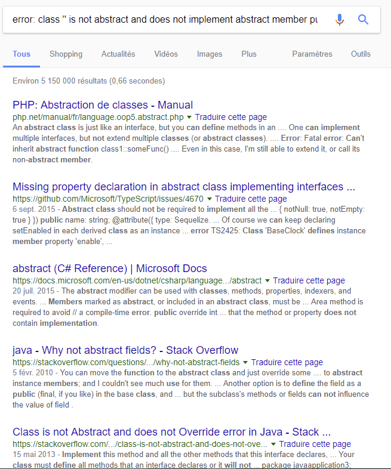
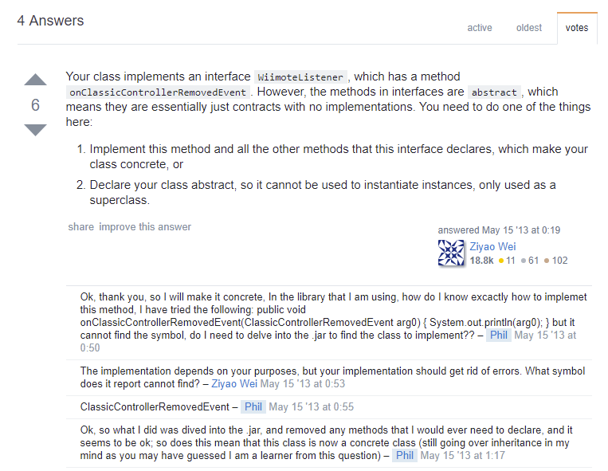

# Chapitre 4<br />Programmation orientée objet

La programmation orientée objet est le fondement de tout développement haut niveau moderne. On pourrait consacrer un livre entier à la programmation orientée objet tellement le sujet est vaste. Le but de ce chapitre n’est donc pas de vous présenter l’intégralité de ce concept, mais seulement de vous donner les connaissances indispensables à la poursuite de ce livre.

Attention, ce chapitre peut paraitre long, et rempli de définitions ; cependant, assurez-vous de bien comprendre l’intégralité de ce qui est dit ici, car c’est la base de toute la suite de ce livre.

## Définitions

### Objets, classes et instances

Un objet, c’est une entité régie par des propriétés et des comportements. Si l’on a choisi le terme objet, c’est bien parce que ce concept peut parfaitement représenter les objets physiques qui nous entourent. Ainsi, prenons l’exemple d’une voiture. Imaginons une voiture de sport rouge et une petite voiture citadine bleue. Si on les représente comme des entités régies par des propriétés et des comportements, on peut définir ces objets voitures comme suit :

* <u>Voiture de sport rouge</u>
  * Propriétés
    * **<u>Couleur</u>** : rouge
    * **<u>Prix</u>** : 120 000 €
    * **<u>État</u>** : comme neuve
    * **<u>Propriétaire</u>** : Monsieur Dupont
    * **<u>Essence restante</u>** : 33 L
  * Comportements
    * **<u>Démarrer en trombe</u>** : Appuyer sur l’accélérateur à fond
    * **<u>Acheter</u>** : Changer le nom du propriétaire
    * **<u>Faire le plein</u>** : L'essence restante passe à 50 L
* <u>Voiture citadine bleue</u>
  * Propriétés
    * **<u>Couleur</u>** : bleue
    * **<u>Prix</u>** : 1 500 €
    * **<u>État</u>** : cabossée
    * **<u>Propriétaire</u>** : Monsieur Durant
    * **<u>Essence restante</u>** : 43 L
  * Comportements
    * **<u>Démarrer en trombe</u>** : Appuyer sur l’accélérateur à fond
    * **<u>Acheter</u>** : Changer le nom du propriétaire
    * **<u>Faire le plein</u>** : L'essence restante passe à 50 L

Ainsi, on peut voir que la liste des comportements et des propriétés est commune à nos deux voitures. Chacune des deux a une couleur, un prix, un état, et a la possibilité de démarrer en trombe ou d’être achetée. De cette manière, la liste des propriétés et des comportements va définir ce que l’on appelle une **classe**. Ainsi, on peut définir la **classe** `Voiture` comme étant un objet avec une couleur, un prix, un état et pouvant démarrer en trombe.

Par contre, les deux voitures ne sont pas les mêmes. Il s’agit de deux objets distincts de la classe `Voiture`, ayant chacune des valeurs distinctes pour ses propriétés. Si j’active le comportement `Acheter` de la voiture de sport rouge, seule celle-ci doit voir le nom de son propriétaire changer.

Par conséquent, chacune de ces voitures est une **instance** de la classe `Voiture`.

### Propriétés et Méthodes

Nous avons déjà défini ce qu’étaient les **propriétés** d’une classe. Les **méthodes** d’une classe ne sont que ce que nous avons appelé les comportements de cette classe. Nous utiliserons donc les termes **méthodes** et **propriétés** dans la suite de ce livre.

### Null, Nullables et Non Nullables

Imaginons maintenant une classe `Personne`. Cette classe définit une personne, et pour faire simple, cette classe ne possède que deux propriétés : `voiture`, qui contient l’instance de la classe `Voiture` que possède cette personne, et `date de naissance`, qui contient l’instance de la classe `Date` correspondant à la date de naissance de la personne.

Ainsi, il m’est possible pour une personne donnée de connaitre la couleur de sa voiture. Malheureusement, tout n’est pas aussi simple, car il se peut qu’une personne ne possède pas de voiture. Dans ce cas, on dira que la valeur de la propriété `voiture` est **null**. Comme on peut affecter **null** à la propriété `voiture`, on dira que cette dernière est **nullable**.

Par contre, toute personne ayant une date de naissance, il n’est pas possible pour une personne donnée que la valeur de `date de naissance` soit **null**. Ainsi, on dira que la propriété `date de naissance` est **non nullable**.

### Héritage

Imaginons maintenant une classe `Véhicule` regroupant tous les types de véhicules. Cette classe va avoir des propriétés, comme par exemple une couleur, un prix, etc., et des méthodes comme Démarrer en trombe, etc. Par contre, cette classe n’aura pas de propriété Essence restante ou de méthode Faire le plein. Cela n’aurait pas de sens par exemple pour un vélo.

Par contre, la classe `Voiture` possède bien toutes les propriétés et toutes les méthodes de la classe `Véhicule`, mais possède en plus des propriétés et des méthodes qui sont propres aux voitures, comme Faire le plein. On dit alors que la classe `Voiture` **hérite** de la classe `Véhicule`, ou qu’elle l’**étend**. Si bien qu’une instance de la classe `Voiture` pourra très bien être considérée comme une instance de la classe `Véhicule` *(La réciproque est fausse, car si l’on a une instance de la classe `Véhicule`, alors il n’est pas possible de savoir de quel type de véhicule il s’agit, on ne peut donc pas considérer une instance de la classe `Véhicule` comme une instance de la classe `Voiture`)*.

De plus, il est possible d’imbriquer plusieurs niveaux de classe. Ainsi, on pourra avoir une classe `Véhicule Motorisé` qui **hérite** de `Véhicule`. On peut ensuite imaginer que `Voiture` **hérite** de `Véhicule Motorisé`.

Par contre, une classe ne peut avoir qu’une seule classe parente directe. Si `Voiture` **hérite** de `Véhicule Motorisé`, alors elle ne peut **hériter** que de cette classe.

### Interfaces et implémentations

Une **interface**, c’est un groupe contenant plusieurs méthodes, mais qui peut ne pas définir ce que font ces méthodes.

Pour reprendre l’exemple utilisé précédemment, on peut définir une **interface** `Objet Roulant`. La seule chose que l’on puisse dire d’un `Objet Roulant`, c’est qu’il possède la méthode `rouler`. Par contre, il est impossible de définir ce que `rouler` veut dire pour un `Objet Roulant`. Imaginons deux objets aussi variés qu’une bille et une voiture…

Par contre, on peut dire de l’objet `Voiture` qu’elle hérite de `Véhicule Motorisé`, et qu’elle **implémente** `Objet Roulant`. L’objet `Voiture` devra donc définir ce que la méthode `rouler` fait exactement (faire tourner les quatre roues par exemple).

Un objet peut **implémenter** autant d’**interfaces** qu’on le souhaite.

## Place à la pratique

Nous allons désormais illustrer tous ces concepts théoriques à travers du code Kotlin. Pour ce faire, nous allons développer un programme en se basant sur les exemples des chapitres précédents, avec des calculs sur les formes géométriques.

### Classe

En Kotlin, il est d’usage de définir une classe par fichier, et un fichier par classe. Ainsi, on donne au fichier le nom de la classe. Commençons par définir une classe `Triangle` dans un fichier `Triangle.kt`.

En Kotlin, pour définir une classe, on utilise le mot clé `class`, suivi du nom de la classe, et enfin d’accolades permettant de délimiter le contenu de la classe.

<div class="fileTitle">Triangle.kt</div>

```kotlin
package geometry.triangle

/**
 * This class represent what a triangle is
 */
class Triangle{
   // Content of the class triangle
}

```

### Propriétés

Nous pouvons maintenant définir les propriétés de notre classe. Les propriétés sont des variables appartenant à la classe. Nous allons définir trois propriétés, une pour chaque côté du triangle :

<div class="fileTitle">Triangle.kt</div>

```kotlin
package geometry.triangle

/**
 * This class represent what a triangle is
 */
class Triangle{
   /** First side of the triangle */
   val side1:Int
   /** Second side of the triangle */
   val side2:Int
   /** Third side of the triangle */
   val side3:Int
}
```

### Méthodes

<p class="pageBreakAfter">Nous pouvons maintenant définir une méthode. Les méthodes ne sont rien d’autre que des fonctions de la classe. Nous allons donc définir une méthode pour calculer le périmètre du triangle :</p>

<div class="fileTitle">Triangle.kt</div>

```kotlin
package geometry.triangle

/**
 * This class represent what a triangle is
 */
class Triangle{
   /** Length of the first side of the triangle */
   val side1Length:Double
   /** Length of the second side of the triangle */
   val side2Length:Double
   /** Length of the third side of the triangle */
   val side3Length:Double

   /**
    * Returns the perimeter of the triangle.
    * @return the perimeter of the triangle
    */
   fun perimeter():Double{
       return side1Length+side2Length+side3Length
   }

   /**
    * Returns the area of the triangle.
    * @return the area of the triangle
    */
   fun area():Double{
      val halfPerimeter = perimeter()/2.0
      // Using area formula square of area is p(p-a)(p-b)(p-c) when p is half of the perimeter
      val squareArea = halfPerimeter*
                       (halfPerimeter-side1Length)*
                       (halfPerimeter-side2Length)*
                       (halfPerimeter-side3Length)
      return Math.sqrt(squareArea)
   }
}
```

### Instances et appel aux méthodes

Nous allons maintenant créer notre programme principal dans un fichier nommé `Geometry.kt`. Ce programme se contentera de créer une instance de la classe `Triangle` et d’afficher le périmètre d’un triangle.

En Kotlin, pour créer une instance d’une classe, on utilise le nom de la classe suivi de parenthèses.

Pour appeler une méthode, on utilise le point `.` entre le nom de la variable, et le nom de la méthode que l’on souhaite appeler.

<p class="pageBreakAfter">Ainsi, le code de notre fichier <code>Geometry.kt</code> est :</p>

<div class="fileTitle">Geometry.kt</div>

```kotlin
package geometry

import geometry.triangle.Triangle

/**
 * Main function of the program.
 */
fun main(args: Array<String>) {
   val triangle = Triangle()
   println("Perimeter of the triangle is: "+triangle.perimeter())
   println("Area of the triangle is: "+triangle.area())
}
```

Essayez de compiler ce programme, vous obtiendrez une erreur :

<pre class="terminal"><code class="terminal">geometry\triangle\Triangle.kt:8:5: error: property must be initialized or be abstract
    val side1Length:Double
    ^
geometry\triangle\Triangle.kt:10:5: error: property must be initialized or be abstract
    val side2Length:Double
    ^
geometry\triangle\Triangle.kt:12:5: error: property must be initialized or be abstract
    val side3Length:Double
    ^</code></pre>

En fait, Kotlin nous dit que les valeurs de nos trois côtés n’ont pas été spécifiées. En fait, ces valeurs sont non nullables par défaut, il nous est donc impératif de leur donner une valeur *(Nous verrons plus tard dans ce chapitre comment spécifier qu’une valeur est nullable en Kotlin)*.

### Constructeur

Observez à nouveau comment nous avons créé une instance de `Triangle` : en écrivant `Triangle()`. Cette notation ne vous rappelle rien ? Elle ressemble étrangement à un appel à une fonction. C’est justement parce que la création d’une instance est une fonction ; une fonction qu’il n’est pas indispensable de définir, c’est pourquoi cet appel est correct. Mais nous pouvons, si nous le souhaitons, définir cette fonction.

En fait, cette fonction s’appelle un constructeur.

<p class="pageBreakAfter">Ce que nous souhaitons, c’est pouvoir donner au constructeur trois arguments, à savoir les longueurs des trois côtés du triangle. Pour ce faire, nous allons définir ces trois arguments juste après le nom de la classe :</p>

<div class="fileTitle">Triangle.kt</div>

```kotlin
package geometry.triangle

/**
 * This class represent what a triangle is
 * @param side1Length the length of the first side of the triangle to set
 * @param side2Length the length of the second side of the triangle to set
 * @param side3Length the length of the third side of the triangle to set
 */
class Triangle(side1Length:Double, side2Length:Double, side3Length:Double){
    // ...
}
```

Maintenant, il nous faut définir le contenu de la méthode constructeur. Cela se fait en utilisant un bloc `init` délimité par des accolades :

<div class="fileTitle">Triangle.kt</div>

```kotlin
package geometry.triangle

/**
 * This class represent what a triangle is
 * @param side1Length the length of the first side of the triangle to set
 * @param side2Length the length of the second side of the triangle to set
 * @param side3Length the length of the third side of the triangle to set
 */
class Triangle(side1Length:Double, side2Length:Double, side3Length:Double){
    // ...
    init{
       // content of constructor method
    }
}
```

### Mot clé `this`

En fait, ce que nous voulons pour notre constructeur, c’est que la valeur de l’argument `side1Length` du constructeur soit affectée à la propriété `side1Length` de la classe `Triangle`.

Dans une méthode, si l’on utilise `side1Length`, la méthode va, dans l’ordre :

* Utiliser l’argument `side1Length` de la méthode ;
* Si la méthode ne possède pas d’argument de ce nom, comme dans la fonction `perimeter`, la méthode utilisera la propriété `side1Length` ;
* Si `side1Length` n’est ni le nom d’un argument, ni le nom d’une propriété, alors le compilateur refusera de compiler le programme.

Mais comment faire alors, dans le constructeur, pour utiliser la référence à la propriété `side1Length` ? Dans ce cas, nous pouvons utiliser le mot clé `this`, qui fait référence à l’instance de l’objet actuel. Ainsi, `this.side1Length` fera référence à la propriété du même nom, et non à l’argument de la méthode.

Nous savons désormais comment définir notre constructeur :

<div class="fileTitle">Triangle.kt</div>

```kotlin
package geometry.triangle

class Triangle(side1Length:Double, side2Length:Double, side3Length:Double){
   // ...
   init{
       this.side1Length = side1Length
       this.side2Length = side2Length
       this.side3Length = side3Length
   }
}
```

Nous n’avons plus qu’à ajouter ces trois arguments lors de l’instanciation de la classe `Triangle` dans le fichier `Geometry.kt` :

<div class="fileTitle">Triangle.kt</div>

```kotlin
package geometry

import geometry.triangle.Triangle

/**
 * Main function of the program.
 */
fun main(args: Array<String>) {
   val triangle = Triangle(3.0, 4.0, 5.0)
   println("Perimeter of the triangle is: "+triangle.perimeter())
   println("Area of the triangle is: "+triangle.area())
}
```

Vous pouvez désormais compiler le programme, et l’exécuter pour observer un résultat semblable à nos attentes :

<pre class="terminal pageBreakAfter"><code class="terminal">Perimeter of the triangle is: 12.0
Area of the triangle is: 6.0</code></pre>

### Héritage

Par défaut, en Kotlin, il n’est pas possible d’étendre une classe. Ainsi, vous ne pouvez pas créer de classe qui étende `Triangle` par défaut. Pour modifier ce comportement par défaut, il suffit d’ajouter le mot clé `open` avant le mot clé `class` de la classe que l’on souhaite voir étendue. Ainsi, notre classe `Triangle` devient :

<div class="fileTitle">Triangle.kt</div>

```kotlin
package geometry.triangle

open class Triangle(side1Length:Double, side2Length:Double, side3Length:Double){
   // ...
}
```

Désormais, nous pouvons définir une classe qui étende la classe `Triangle`. C’est ce que nous allons voir tout de suite en créant une classe `RightTriangle` (triangle rectangle). Pour spécifier qu’une classe étend une autre classe, on fait suivre le nom de la classe de deux points `:`, suivi du nom de la classe parente :

<div class="fileTitle">RightTriangle.kt</div>

```kotlin
package geometry.triangle

/**
 * This class represent what a right triangle is
 */
class RightTriangle:Triangle{

}
```

Pour le moment, la classe `RightTriangle` a exactement les mêmes propriétés et les mêmes méthodes que `Triangle`. Mais nous allons la modifier.

#### Surcharge du constructeur

La surcharge, en objet, consiste à redéfinir une méthode déjà présente dans la classe parente. Nous allons surcharger le constructeur, afin qu’il ne prenne que deux arguments (la longueur des deux côtés formant un angle droit). Nous calculerons ensuite la longueur du troisième côté (l'hypoténuse) à partir de la longueur des deux autres.

Pour ce faire, nous allons définir les arguments du constructeur de `RightTriangle` comme nous l’avons fait pour `Triangle`, puis nous allons faire l’appel au constructeur de `Triangle` (donc avec trois arguments) à partir des deux valeurs du constructeur de `RightTriangle`.

<div class="fileTitle">RightTriangle.kt</div>

```kotlin
package geometry.triangle

/**
 * This class represent what a right triangle is
 */
class RightTriangle constructor(side1Length:Double, side2Length:Double):
       Triangle(side1Length,
                side2Length,
                // Third length is square root of the sum of square of lengths
                // of both other sides
                Math.sqrt(Math.pow(side1Length, 2.0)+Math.pow(side2Length, 2.0))
               ){

}
```
<p style="text-align:center"><i>Retenez que Math.sqrt(x) calcule la racine carrée de x, et Math.pow(x, 2.0) calcule le carré du nombre x.<br />
Notez bien l’intérêt d’aérer votre code et d’ajouter des commentaires dès que celui-ci devient complexe.</i></p>

#### Surcharge de méthode

Nous avons vu comment surcharger le constructeur, mais nous pouvons tout aussi bien surcharger des méthodes.

Prenons par exemple la méthode `area()` de la classe `Triangle`, nous pourrions avoir envie de la surcharger pour utiliser un calcul beaucoup plus simple dans `RightTriangle`.

Pour cela, comme nous l’avons fait pour la classe `Triangle`, nous devons préciser que la méthode `area()` peut être surchargée. Pour ce faire, on ajoute toujours le mot clé `open` devant :

<div class="fileTitle">Triangle.kt</div>

```kotlin
open fun area():Double{
   // ...
}
```

<p class="pageBreakAfter">Dans la classe «enfant», pour surcharger une méthode, on se contente de définir une méthode comportant le même identifiant, la même valeur de retour et des arguments de même type dans le même ordre, en faisant précéder la définition du mot clé <code>override</code> :</p>

<div class="fileTitle">RightTriangle.kt</div>

```kotlin
/**
 * Returns the area of the right triangle.
 * @return the area of the right triangle
 */
override fun area():Double{
    return side1Length * side2Length / 2.0
}
```

#### Principe d’héritage

L’un des grands avantages de l’héritage, c’est qu’un objet de type `RightTriangle` peut être considéré comme un objet de type `Triangle`.

Considérons alors que nous écrivons la fonction suivante dans `Geometry.kt` :

<div class="fileTitle">Geometry.kt</div>

```kotlin
/**
 * Displays the perimeter and the area of [triangle]
 * @param triangle the triangle for which to display the perimeter and the area
 */
fun displayTriangleData(triangle:Triangle){
   println("Perimeter of the triangle is: "+triangle.perimeter())
   println("Area of the triangle is: "+triangle.area())
}
```

En argument de cette fonction, je peux passer aussi bien un argument de type `Triangle`, qu’un argument d’un type qui hérite de triangle, comme `RightTriangle`.

Ainsi, écrire la fonction main suivante est tout à fait correct :

<div class="fileTitle">Geometry.kt</div>

```kotlin
/**
 * Main function of the program.
 */
fun main(args: Array<String>) {
   val triangle = Triangle(3.0, 4.0, 6.0)
   val rightTriangle = RightTriangle(3.0, 4.0)

   displayTriangleData(triangle)
   // Passing RightTriangle, which will be considered as Triangle
   displayTriangleData(rightTriangle)
}
```

<p class="pageBreakAfter">On peut compiler ce programme, et le résultat produit lors de l’exécution sera celui attendu :</p>

<pre class="terminal"><code class="terminal">Perimeter of the triangle is: 13.0
Area of the triangle is: 5.332682251925386
Perimeter of the triangle is: 12.0
Area of the triangle is: 6.0</code></pre>

### Interface

Toutes les formes planes (considérons le cas général) ont un périmètre et une aire. Nous pouvons donc définir une interface `PlaneShape` contenant deux méthodes, `perimeter()` et `area()`.

Par contre, il n’existe pas de formule pour calculer l’aire ou le périmètre d’une forme plane. On ne peut donc pas définir le contenu de ces méthodes, mais on peut définir qu’elles existent. On appelle cela des méthodes abstraites. La définition d’une méthode abstraite est la même que celle d’une méthode classique, à la différence près qu’elle ne comportera pas d’accolades puisqu’il n’y a pas de contenu.

Aussi, nous pouvons écrire une interface `PlaneShape` comme suit :

<div class="fileTitle">PlaneShape.kt</div>

```kotlin
package geometry

/**
 * Interface describing a geometrical plane shape.
 */
interface PlaneShape{
   /**
    * Returns the perimeter of the shape.
    * @return the perimeter of the shape
    */
   fun perimeter():Double

   /**
    * Returns the area of the shape.
    * @return the area of the shape
    */
   fun area():Double
}
```

<p class="pageBreakAfter">Nous pouvons maintenant déclarer que la classe <code>Triangle</code> implémente l’interface <code>PlaneShape</code>, tout comme pour l’héritage, en ajoutant : suivi du nom de l’interface qu’il implémente.</p>

<div class="fileTitle">Triangle.kt</div>

```kotlin
package geometry.triangle

import geometry.PlaneShape

/**
 * This class represent what a triangle is
 * @param side1Length the length of the first side of the triangle to set
 * @param side2Length the length of the second side of the triangle to set
 * @param side3Length the length of the third side of the triangle to set
 */
open class Triangle(side1Length:Double, side2Length:Double, side3Length:Double):PlaneShape{
// ...
}
```

Toutes les méthodes d’une interface sont surchargeables. Nous pouvons donc supprimer le mot clé `open` de la méthode `area()` de la classe `Triangle`, puisque cette méthode est déjà considérée par `open`, étant donné qu’elle est définie dans l’interface `PlaneShape`.

Il ne nous reste plus qu’à ajouter le mot clé `override` devant les méthodes `perimeter()` et `area()` pour préciser qu’elles surchargent les méthodes de l’interface, et l’implémentation est terminée.

#### Petite parenthèse technique

Très bien, notre classe `Triangle` implémente `PlaneShape`, mais quelle est l’utilité d’une telle implémentation ? Ajoutons une classe `Circle` implémentant `PlaneShape` et définissant la méthode `perimeter()` pour en comprendre l’utilité.

<div class="fileTitle pageBreakBefore">Circle.kt</div>

```kotlin
package geometry.circle

import geometry.PlaneShape

/**
 * This class represent what a circle is
 * @param diameter the length of the diameter of the circle to set
 */
open class Circle(diameter:Double):PlaneShape{
   /** Length of the diameter of the circle */
   val diameter:Double

   init{
       this.diameter = diameter
   }

   /**
    * Returns the circumference of the circle.
    * @return the circumference of the circle
    */
   override fun perimeter():Double{
       return diameter*Math.PI
   }
}
```

Essayons de compiler ce programme, le résultat sera le suivant :

<pre class="terminal"><code class="terminal">geometry\circle\Circle.kt:9:6: error: class 'Circle' is not abstract and does not implement abstract member public abstract fun area(): Double defined in geometry.PlaneShape
open class Circle(diameter:Double):PlaneShape{</code></pre>

Personnellement, je ne comprends pas d’où vient cette erreur (en réalité, si, mais faisons comme si je ne savais pas d’où venait cette erreur).

Il va donc falloir que j’aille sur Internet chercher ce que cette erreur peut bien vouloir dire. Je vais donc copier le message d’erreur, j’obtiens :

_**error: class 'Circle' is not abstract and does not implement abstract member public abstract fun area(): Double defined in geometry.PlaneShape**_

À partir de là, je vais supprimer de ce message d’erreur tout ce qui est propre au programme que j’ai développé, comme les noms des classes, des méthodes et des interfaces :

_**error: class '' is not abstract and does not implement abstract member public abstract fun(): defined in **_

Très bien, maintenant, il ne reste plus qu’à copier/coller ce message dans Google :

<p></p>

Regardons dans l’ordre :

* Le premier résultat concerne du PHP, donc peu de chances que j’y trouve mon bonheur ;
* Le second résultat ne me dit rien, en plus dans l’URL, je vois du Microsoft, faible probabilité que j’y décèle une réponse ;
* Le troisième résultat concerne du C#, éventualité fragile qu’il m’apporte une solution ;
* Le quatrième résultat est à propos de Java, or, nous avons vu au début de ce livre que Kotlin était basé sur du Java, cela peut m’intéresser ;
* Le cinquième résultat concerne aussi du Java, et je retrouve dans le titre un message vraiment similaire à mon message d’erreur. Il y a de très fortes chances que j’y apprenne quelque chose d’utile.

Je clique donc sur le cinquième lien. Il s’agit d’une question sur StackOverflow. Si vous vous mettez sérieusement au développement, le site StackOverflow va devenir très rapidement votre meilleur ami. Il s’agit d’un site de questions/réponses à propos de développement.

On va passer sur la question, car rien que le titre m’indique que la personne ayant posé la question a exactement le même problème que moi, je vais donc directement passer à la réponse :

<p></p>

On va s’intéresser à une partie seulement de la réponse :

> You need to do one of the things here:
1. Implement this method and all the other methods that this interface declares

Ainsi, nous avons déjà une piste pour savoir d’où vient notre erreur. Il semblerait qu’il faille que nous implémentions toutes les méthodes de notre interface. Or, dans la classe `Circle`, nous avons bien implémenté la méthode `perimeter()`, mais pas la méthode `area()`.

D’ailleurs, à y regarder de plus près, c’est bien ce que nous disait exactement le message d’erreur :

<pre class="terminal"><code class="terminal">geometry\circle\Circle.kt:9:6: error: class 'Circle' is not abstract and does not implement abstract member public abstract fun area(): Double defined in geometry.PlaneShape
open class Circle(diameter:Double):PlaneShape{</code></pre>

Trois choses à retenir de cette petite parenthèse :
* Vous ne trouverez pas tout sur tout dans ce livre. C’est la raison pour laquelle j’ai trouvé indispensable de vous montrer comment résoudre seul un problème que l’on rencontre. Par exemple, vous pourriez essayer de chercher d’où vient le `Math.PI` que j’utilise dans le code sans l’avoir expliqué.
* Certains logiciels de développement proposent une configuration en français, ou bien adaptent les raccourcis clavier à un clavier français. Fuyez ces options, garder tout en anglais permet de trouver de meilleures réponses lorsque l’on cherche une information.
* Sur StackOverflow, vous pouvez vous aussi poser des questions si vous ne trouvez pas votre bonheur après avoir cherché sur Internet. En vous habituant à développer en anglais, vous pourrez partager votre code sur ce site, ce qui accélèrera les réponses que vous obtiendrez.

Nous pouvons donc maintenant corriger notre classe Circle :

<div class="fileTitle">Circle.kt</div>

```kotlin
package geometry.circle

import geometry.PlaneShape

/**
 * This class represent what a circle is
 * @param diameter the length of the diameter of the circle to set
 */
open class Circle(diameter:Double):PlaneShape{
   /** Length of the diameter of the circle */
   val diameter:Double

   init{
       this.diameter = diameter
   }

   /**
    * Returns the circumference of the circle.
    * @return the circumference of the circle
    */
   override fun perimeter():Double{
       return diameter*Math.PI
   }

   /**
    * Returns the area of the circle.
    * @return the area of the circle
    */
   override fun area():Double{
       return diameter*Math.pow(Math.PI, 2.0)/2.0
   }
}
```

### Utilité des interfaces

Nous avons donc implémenter notre interface dans deux classes distinctes. Mais quelle en est l’utilité ?

De la même façon que nous avons pu utiliser une variable de type `Triangle` dans `Geometry.kt` pour calculer l’aire et le périmètre aussi bien d’un `RightTriangle` que d’un `Triangle`, nous pourrions avoir envie de faire la même chose avec `PlaneShape`.

Dans `Geometry.kt`, remplacez la fonction `displayTriangleData` par la fonction suivante :

<div class="fileTitle pageBreakBefore">Geometry.kt</div>

```kotlin
/**
 * Displays the perimeter and the area of [planeShape]
 * @param planeShape the plane shape for which to display the perimeter and the area
 */
fun displayPlaneShapeData(planeShape:PlaneShape){
   println("Perimeter of the plane shape is: "+planeShape.perimeter())
   println("Area of the plane shape is: "+planeShape.area())
}
```

On voit ici que l’on peut passer n’importe quelle variable d’une classe implémentant `PlaneShape` à cette fonction :

<div class="fileTitle">Geometry.kt</div>

```kotlin
package geometry

import geometry.PlaneShape
import geometry.circle.Circle
import geometry.triangle.Triangle
import geometry.triangle.RightTriangle
import java.util.Date

/**
 * Main function of the program.
 */
fun main(args: Array<String>) {
   val triangle = Triangle(3.0, 4.0, 6.0)
   val rightTriangle = RightTriangle(3.0, 4.0)
   val circle = Circle(5.0)

   displayPlaneShapeData(triangle)
   displayPlaneShapeData(rightTriangle)
   displayPlaneShapeData(circle)
}

/**
 * Displays the perimeter and the area of [planeShape]
 * @param planeShape the plane shape for which to display the perimeter and the area
 */
fun displayPlaneShapeData(planeShape:PlaneShape){
   println("Perimeter of the plane shape is: "+planeShape.perimeter())
   println("Area of the plane shape is: "+planeShape.area())
}
```

<h3 class="pageBreakBefore">Null et Nullables</h3>

Imaginons maintenant que la fonction `displayPlaneShapeData()` soit appelée à partir d’une forme dessinée sur une feuille blanche. Il se peut alors qu’il n’y ait rien de dessiné sur cette feuille, auquel cas, on aurait une «absence de forme».

En cas d’absence de forme, il semble logique que l’on ne puisse ni calculer le périmètre, ni calculer l’aire.

En Kotlin, pour définir qu’une variable contient une «absence d’instance de classe», on utilise le mot `null`. Étant donné que `null` s’utilise pour n’importe quel type de variable, nous serons obligé d’utiliser le typage de variable, et ne pourrons pas nous contenter d’un type implicite.

```kotlin
val noShape:PlaneShape = null
```

Toutefois, cette déclaration est erronée. Le compilateur refusera de compiler une telle instruction. Comme nous l’avons dit plus haut, en Kotlin, par défaut, les variables sont non nullables. Ainsi, nous ne pouvons pas définir `null` comme valeur d’une variable par défaut.

Pour rendre une variable nullable, donc pour qu’il soit possible de définir sa valeur comme étant `null`, nous devons ajouter un `?` à la suite de son type.

```kotlin
val noShape:PlaneShape? = null
```

De la même façon, pour pouvoir passer cette variable à la fonction `displayPlaneShapeData()`, il va falloir définir que l’argument est nullable. De la même façon, il suffit d’ajouter un `?` après le type de l’argument :

<div class="fileTitle">Geometry.kt</div>

```kotlin
/**
 * Displays the perimeter and the area of [planeShape]
 * @param planeShape the plane shape for which to display the perimeter and the area
 */
fun displayPlaneShapeData(planeShape:PlaneShape?){
   println("Perimeter of the plane shape is: "+planeShape.perimeter())
   println("Area of the plane shape is: "+planeShape.area())
}
```

Mais si vous faites cela, là encore, le compilateur vous renverra une erreur. Le souci, c’est que vous essayez d’appeler `planeShape.perimeter()`, alors que vous avez spécifié que `planeShape` peut être null.
Les conditions feront l’objet d’un prochain chapitre, mais nous pouvons déjà voir un petit exemple, sans entrer dans les détails de son explication :

<div class="fileTitle">Geometry.kt</div>

```kotlin
/**
 * Displays the perimeter and the area of [planeShape]
 * @param planeShape the plane shape for which to display the perimeter and the area
 */
fun displayPlaneShapeData(planeShape:PlaneShape?){
   if(planeShape == null){
       println("No shape, so no perimeter and no area");
   }
   else {
       println("Perimeter of the plane shape is: " + planeShape.perimeter())
       println("Area of the plane shape is: " + planeShape.area())
   }
}
```

Ici, nous indiquons que si `planeShape` est null, alors nous affichons `"No shape, so no perimeter and no area"`, sinon, nous gardons le même comportement qu’avant.
Encore une fois, cette notation `if ... else` sera vue au cours d’un prochain chapitre. Ne vous en faites pas si vous ne comprenez pas tout pour le moment.

Ainsi, voici le code final du fichier `Geometry.kt` :

<div class="fileTitle pageBreakBefore">Geometry.kt</div>

```kotlin
package geometry

import geometry.PlaneShape
import geometry.circle.Circle
import geometry.triangle.Triangle
import geometry.triangle.RightTriangle
import java.util.Date

/**
 * Main function of the program.
 */
fun main(args: Array<String>) {
   val triangle = Triangle(3.0, 4.0, 6.0)
   val rightTriangle = RightTriangle(3.0, 4.0)
   val circle = Circle(5.0)
   val noShape:PlaneShape? = null

   displayPlaneShapeData(triangle)
   displayPlaneShapeData(rightTriangle)
   displayPlaneShapeData(circle)
   displayPlaneShapeData(noShape)
}

/**
 * Displays the perimeter and the area of [planeShape]
 * @param planeShape the plane shape for which to display the perimeter and the area
 */
fun displayPlaneShapeData(planeShape:PlaneShape?){
   if(planeShape == null){
       println("No shape, so no perimeter and no area");
   }
   else {
       println("Perimeter of the plane shape is: " + planeShape.perimeter())
       println("Area of the plane shape is: " + planeShape.area())
   }
}
```

Une fois compilé, puis exécuté, on obtient bien le résultat attendu :

<pre class="terminal pageBreakAfter"><code class="terminal">Perimeter of the plane shape is: 13.0
Area of the plane shape is: 5.332682251925386
Perimeter of the plane shape is: 12.0
Area of the plane shape is: 6.0
Perimeter of the plane shape is: 15.707963267948966
Area of the plane shape is: 24.674011002723397
No shape, so no perimeter and no area</code></pre>

## Conclusion

Nous en savons désormais assez pour pouvoir démarrer le développement Android, qui sera l’objet du prochain chapitre.

Toutefois, nous n’avons vu qu’une très mince partie de la notion d’objets, et de Kotlin. Nous continuerons à aborder de nouvelles notions dans la suite de ce livre.

### En Kotlin, tout est objet

Dans le second chapitre, nous avons mis en opposition les types primitifs aux instances d’objets. Cette simplification a été faite dans le but de présenter les variables, les constantes, les opérateurs, etc.

Mais en Kotlin, tout est objet, et chaque variable n’est qu’une instance d’un objet. Ainsi, par exemple, ce que nous avons présenté comme le type primitif `Int` n’est rien d’autre qu’une variable contenant une instance de de la classe `Int`.

## Exercices

### Exercice 1 : Facile

Ajoutez une classe `Square` à votre application, qui calculera le périmètre et l’aire d’un carré, et pourra l’afficher dans le programme.

### Exercice 2 : Difficile

Modifiez l’interface `Shape` de sorte qu’elle contienne une propriété `name`, qui permettra d’afficher le nom de la forme plutôt que simplement `"the plane shape"`.
