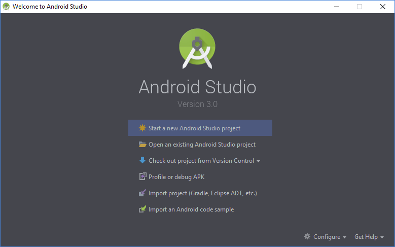
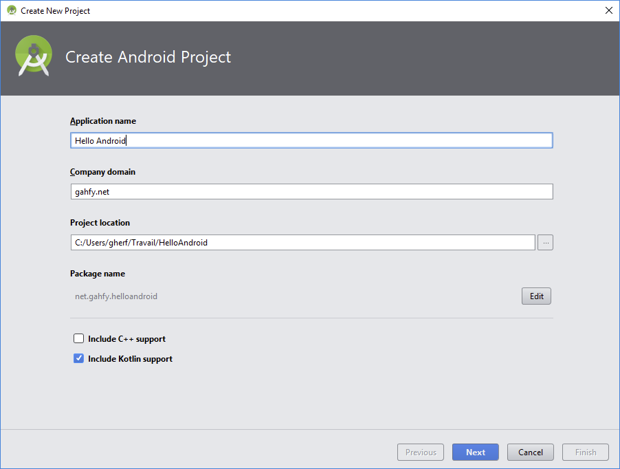
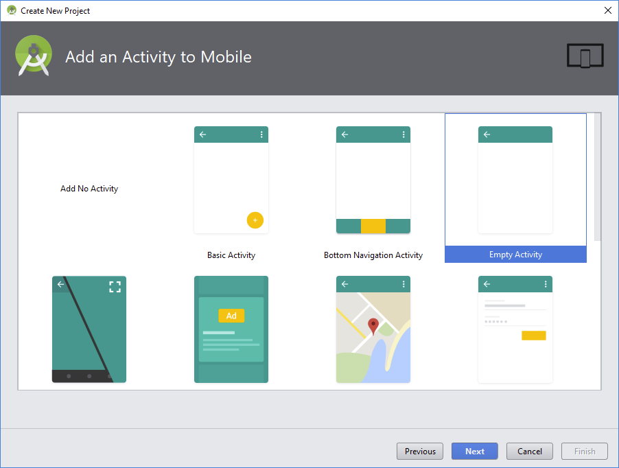
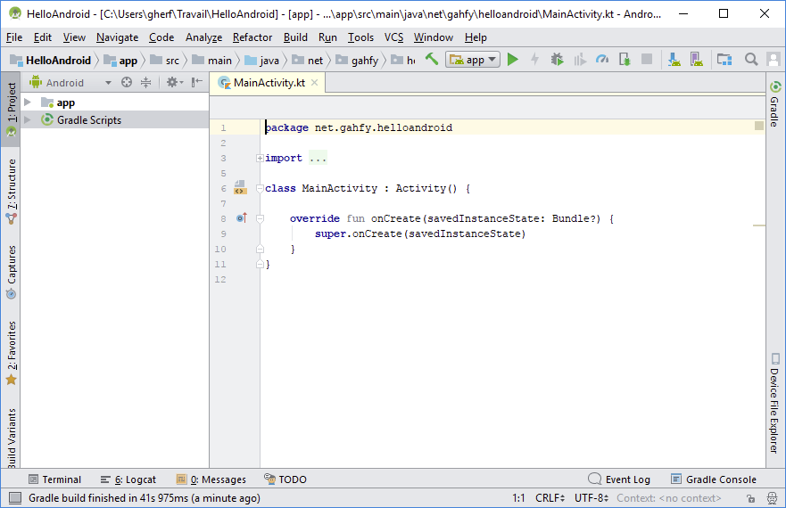
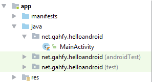
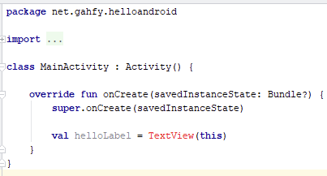
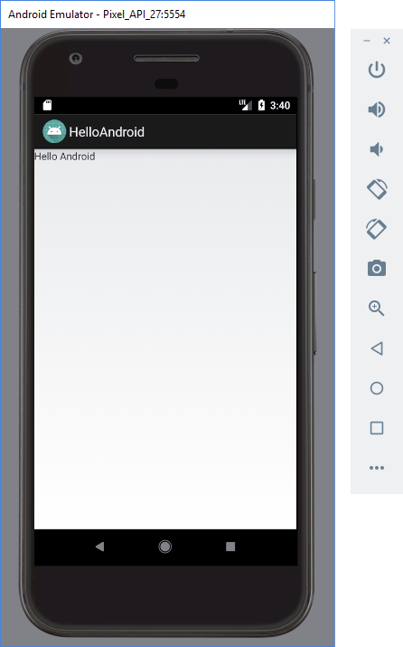

# Chapitre 5<br />Hello Android !

## Android Studio

### Environnement de développement intégré

Avant tout, vous devrez installer Android Studio, qui est un environnement de développement intégré. Un environnement de développement intégré, c’est un outil qui cumule tout ou presque de vos besoins. Il couvre aussi bien la coloration de votre code pour le rendre plus clair, que la compilation, l’affichage de la documentation KDoc, etc.

Si pour certains langages, il existe plusieurs éditeurs avec chacun leurs avantages et leurs inconvénients, pour Android, c’est Android Studio qui est en situation de (quasi) monopole. Le choix est donc vite fait.

### Installation d’Android Studio

Pour installer Android Studio, téléchargez-le à l’adresse suivante : https://developer.android.com/studio/index.html.

Je ne parlerai pas ici de l’installation à proprement parler, puisque celle-ci est parfaitement décrite sur la page sur laquelle vous êtes redirigé lors du téléchargement de ce logiciel.

### Démarrage d’Android Studio

Lorsque vous démarrez Android Studio, vous arrivez sur l’écran suivant :

<p></p>

Comme notre but est de développer une application, nous allons cliquer sur *Start a new Android Studio project*.

Vous arrivez alors sur l’écran suivant :

<p></p>

Nous devons renseigner les différentes informations de notre application, à savoir :

* **Application name** : le nom que l’on souhaite donner à notre application, dans notre cas, **Hello Android** ;
* **Company domain** : cela sert surtout à créer le paquet de base de votre application. En choisissant **gahfy.net**, votre application sera contenue dans le paquet **net.gahfy.helloandroid** ;
* **Project location** : il s’agit du répertoire dans lequel vous souhaitez sauvegarder votre application.

Étant donné que tous nos développements se feront en Kotlin, pensez à bien vérifier que la case **Include Kotlin support** est cochée. Vous pouvez ensuite cliquer sur le bouton `Next`. Vous arrivez alors sur cet écran :

<p></p>

Il s’agit d’un écran permettant de choisir les périphériques sur lesquels votre application doit fonctionner, ainsi que les versions minimales des systèmes Android requises pour faire fonctionner votre application. Ne touchez rien sur cet écran, et cliquez sur `Next`.

<p></p>

Sur cet écran, on vous demande de choisir quel type d’`Activity` vous souhaitez ajouter. Les `Activity` sont la base de toute application Android. Pour résumer, il s’agit d’objets qui vont se charger de créer une fenêtre et d’y ajouter du contenu grâce à des méthodes que l’on utilisera dans la suite de ce chapitre, et également de gérer les interactions avec l’utilisateur. Laissez **Empty Activity** sélectionné, et cliquez sur `Next`.

<p></p>

Sur cet écran, nous allons choisir le nom de notre `Activity`. Décochez simplement **Generate Layout File** et **Backward Compatibility**, et cliquez sur `Finish` en laissant toutes les valeurs telles qu’elles sont. Une boite de dialogue de chargement s’affiche :

<p></p>

Vous êtes ensuite dirigé sur l’écran principal d’Android Studio :

<p></p>

L’écran se décompose en plusieurs parties.

Dans la partie haute, vous avez la barre de menu ainsi que différentes barres d’outils.

Dans la partie de gauche, vous avez l’affichage de l’arborescence de votre projet.

*Si ça n’est pas le cas, cliquez sur l’onglet vertical **1: Project** tout à gauche de la fenêtre. Si cet onglet n’est pas présent, cliquez sur l’icône  tout en bas à gauche de la fenêtre pour afficher cet onglet.*

Dans cette partie, vous pouvez ouvrir la partie **app**, puis la partie **java** pour voir le contenu de votre application (il s’agit du nom de paquet qui n’est pas surligné en vert) :

<p></p>

L’organisation par paquet plutôt que par dossier peut sembler déroutante, mais Android Studio suit la convention dont nous avons parlé pour les paquets, où chaque paquet correspond à un répertoire.

Dans la partie de droite, la partie principale, nous retrouvons l’éditeur d’Android Studio, dans lequel écrire nos codes sources.

On peut remarquer les points de suspension qui suivent le mot clé `import` ; en fait, Android Studio cache les imports qui, avouons-le, ne sont pas d’une importance cruciale dans un code source. Vous pouvez cliquer sur le `+` à côté de `import` pour voir la liste des imports. Une fois la liste des imports développée, vous pouvez cliquer sur le `-` pour la refermer.

Nous verrons dans la suite de ce chapitre que les imports sont automatiquement gérés par Android Studio. Du coup, dans la suite de ce livre, les codes sources ne feront ni mention du paquet, ni mention des imports.

À propos du code source justement…

## Développement de l’application

### Analyse du code existant

Pour le moment, notre application ne se compose que d’un fichier Kotlin, dont le code est le suivant :

<div class="fileTitle">MainActivity.kt</div>

```kotlin
class MainActivity : Activity() {

   override fun onCreate(savedInstanceState: Bundle?) {
       super.onCreate(savedInstanceState)
   }
}
```

Sur la première ligne, on voit le nom de la classe que l’on a choisie, et on voit que cette classe étend `Activity`.

#### *Bibliothèque Android*
*En fait, le développement d’applications sous Android se fait avec la bibliothèque Android. Cette bibliothèque, c’est grosso modo une liste de classes et d’objets qu’Android met à disposition, et dont on peut se servir.*

*Nous avons déjà vu ce qu’était une `Activity` plus haut, à savoir une classe permettant de générer une fenêtre dans laquelle ajouter du contenu. `Activity` est justement une classe faisant partie de la bibliothèque Android.*

Ensuite, nous voyons que nous surchargeons la méthode `onCreate()` héritée de la classe `Activity`. Cette méthode est celle qui est appelée au démarrage de l’`Activity`.

Ensuite, nous voyons un appel à `super.onCreate()`. Ce mot clé `super` sert à indiquer que l’on appelle la méthode `onCreate()` de la classe parente `Activity`. C’est une manière très pratique de garder le comportement de la classe parente, tout en ajoutant du code supplémentaire.

### Ajout de code
Maintenant que nous avons compris le code existant, nous pouvons ajouter le nôtre. Ce que nous allons faire, c’est ajouter un texte **Hello Android!** sur l’écran.

Pour ce faire, nous allons utiliser la classe `TextView` qui fait partie de la bibliothèque Android.

<p></p>

On peut voir qu’en ajoutant cette ligne à notre code, `TextView` est souligné en rouge. En fait, il s’agit d’une erreur dans notre code, et Android Studio nous avertit que notre code ne compilera pas à cause de cette erreur.

En fait, l’erreur en question, c’est qu’il manque l’import de la classe `TextView`. Pour régler ce problème, rien de plus simple, cliquez sur `TextView`, et ensuite appuyez simultanément sur `Alt + Entrée`. Si une liste déroulante apparaît, choisissez l’option `Import`.

Android Studio saura corriger tout seul le problème et ajouter l’import manquant.

Maintenant que nous avons une `TextView`, il ne nous reste plus qu’à définir son contenu, et à indiquer à notre `Activity` que la fenêtre courante doit afficher cette `TextView`. Ceci se fait en deux lignes de code.

<div class="fileTitle">MainActivity.kt</div>

```kotlin
class MainActivity : Activity() {

   override fun onCreate(savedInstanceState: Bundle?) {
       super.onCreate(savedInstanceState)

       val helloLabel = TextView(this)
       helloLabel.setText("Hello Android")

       setContentView(helloLabel)
   }
}
```

Nous avons appelé la méthode `setText()` de `TextView`, qui permet de définir le texte de notre `TextView`.

Et ensuite, nous avons appelé la méthode `setContentView()`, définie dans `Activity`, qui sert à définir le contenu affiché par l’`Activity`.

## Exécution d’une application Android

Maintenant que nous avons terminé le développement de notre application très sommaire, nous allons l’exécuter.

Pour ce faire, dans la barre d’outils, cliquez sur l’icône  située juste à côté de `app` en haut à droite :

<p></p>

Android Studio vous ouvre alors la boite de dialogue suivante :

<p></p>

Cette boite de dialogue permet de sélectionner le terminal Android sur lequel vous souhaitez exécuter votre application. On voit ici que la boite est vide.

### Exécution sur son téléphone

Un moyen pour tester une application est de la tester sur son téléphone. À cette fin, vous devez activer le mode développeur de votre téléphone, et activer le debogage USB.

Pour ce faire :

* Allez dans l’application Paramètres de votre téléphone ;
* Cliquez sur la rubrique À propos tout en bas ;
* Allez dans la rubrique Informations sur le Logiciel ;
* Cliquez sept fois de suite sur la partie Numéro de version, jusqu’à ce qu’un message apparaisse vous indiquant que le mode développeur est activé ;
* Retournez ensuite dans le menu des Paramètres ;
* Cliquez dans la nouvelle section Options de développements ;
* Vérifiez que le débogage USB est bien activé, ou activez-le si ce n’est pas le cas.

Vous pouvez à nouveau relier votre téléphone en USB à votre ordinateur, et cliquer sur Autoriser dans la boite de dialogue qui s’ouvre sur votre téléphone.

Après cela, vous devriez voir votre téléphone disponible dans la boite de sélection du terminal Android sur Android Studio :

<p></p>

### Exécution sur un émulateur

Si vous n’avez pas de téléphone, il est possible de tester votre application sur un émulateur. Pour faire cela, cliquez sur le bouton `Create New Virtual Device` en bas de la boite de sélection du terminal Android. Vous arrivez alors sur un écran vous proposant le type de terminal sur lequel vous souhaitez exécuter votre application :

<p></p>

Dans la partie de gauche, vous pouvez sélectionner le type de terminal sur lequel vous souhaitez exécuter votre application : TV, Montre, Smartphone ou Tablette.

Dans la partie centrale, vous pouvez choisir un modèle prédéfini, avec des caractéristiques matérielles qui leur sont propres en termes de résolution, de taille, et même de forme d’écran (dans le cas des montres).

Dans la partie de droite, vous pouvez voir un récapitulatif des caractéristiques du modèle choisi.

Pour la suite de ce chapitre, nous admettrons que vous avez choisi le smartphone **Pixel**. Une fois ceci fait, cliquez sur le bouton `Next`.
Vous arrivez alors sur l’écran suivant :

<p></p>

Il s’agit d’un écran sur lequel vous pouvez choisir la version d’Android que vous souhaitez voir installée sur le terminal. Cela peut avoir son importance. Imaginons par exemple que vous développiez une application en utilisant le groupement des notifications par type, disponible seulement depuis Android Oreo. Vous pourriez avoir envie de contrôler que cette fonctionnalité soit bien présente sur un téléphone exécutant cette version ou une version ultérieure, mais vérifiez aussi que votre application reste compatible avec les versions antérieures.

Pour la suite de ce chapitre, nous admettrons que vous avez choisi `API 27` (Cliquez si besoin sur `Download` pour télécharger cette version d’Android pour un émulateur). Une fois que c’est fait, cliquez sur le bouton `Next`.

Vous arrivez alors sur l’écran suivant :

<p></p>

Il s’agit de régler les derniers détails avancés de votre émulateur. Pour le moment, nous ne toucherons à rien dans cette partie, et nous nous contenterons de cliquer sur le bouton `Finish`. Vous pouvez alors voir que votre émulateur apparait dans la liste des terminaux disponibles :

<p></p>

Sélectionnez-le et cliquez sur `OK`.

La fenêtre va alors se fermer, et après un temps plus ou moins long de chargement, une nouvelle apparaitra. Il s’agira de votre émulateur exécutant votre application :

<p></p>

Par défaut, les Activity sous Android ont une barre d’action. Ici, il s’agit de la barre grise que l’on voit en haut, avec l’icône et le nom (HelloAndroid) de l’application.

En dessous, nous retrouvons le contenu que nous avons affecté à notre `Activity`, à savoir la `TextView` contenant **Hello Android!**.

## Plus loin avec Android Studio

Avant de terminer ce chapitre, deux petites astuces avec Android Studio. D’ailleurs, nous vous donnerons des astuces sur l’utilisation d’Android Studio tout au long de ce livre.

### Affichage sombre

Nous l’avons vu depuis le début, l’affichage d’Android Studio est très clair : fond blanc, barre d’outils gris clair, etc. <span class="web_inline_dark_only" style="display:none"><i>(Les affichages d'Android Studio dans le livre et dans la version Web sur fond clair sont clairs, comme ceux que vous avez du observer si vous n'avez rien modifié. Dans cette version Web Night, les affichages ont été sombres depuis le début pour respecter le thème d'affichage). </i></span>C’est l’affichage par défaut d’Android Studio. Toutefois, il peut être préférable, lorsque vous passez plusieurs heures sur ce logiciel, d’avoir une interface sombre, qui diminue la fatigue visuelle et les migraines.

Par défaut, Android Studio s’affiche en utilisant le thème `Intellij`. Mais il existe un thème, nommé `Darcula`, qui permet de rendre l’affichage global sombre.

<p></p>

##### macOs

* Dans la barre de menu, cliquez sur **Android Studio** ;
* Cliquez sur **Préférences** ;
* Ouvrez l’onglet **Appearance & Behaviour** s’il n’est pas déjà ouvert ;
* Cliquez sur le sous-menu **Appearance** ;
* Changez la valeur de **Theme** pour que cela devienne **Darcula** ;
* Cliquez sur le bouton `Apply`.

##### Linux et Windows

* Dans la barre de menu, cliquez sur **File** ;
* Cliquez sur **Settings** ;
* Ouvrez l’onglet **Appearance & Behaviour** s’il n’est pas déjà ouvert ;
* Cliquez sur le sous-menu **Appearance** ;
* Changez la valeur de **Theme** pour que cela devienne **Darcula** ;
* Cliquez sur le bouton **Apply**.

#### Conseils sur le thème à choisir

Lorsque vous développez, nous vous conseillons d’utiliser le thème Darcula. Toutefois, le thème Intellij présente quelques avantages, et reste à privilégier si vous décidez de :

* Partager sur un blog ou un site dont le fond est clair, pour les mêmes raisons ;
* Écrire un livre, sur des pages blanches, car le thème clair est plus approprié ;
* Faire une présentation en public : le thème clair étant plus contrasté se voit mieux de loin.

<h3 class="pageBreakBefore">Gestion des émulateurs</h3>

Lorsque vous exécutez une application, nous avons vu que vous aviez la possibilité de choisir et créer un émulateur. Android studio permet toutefois d’accéder au gestionnaire d’émulateurs directement. Il suffit pour cela de cliquer sur l’icône  située en haut à droite dans la barre d’outils. Cela va alors ouvrir la fenêtre suivante :

<p></p>

Les trois icônes de la dernière colonne vous permettent dans l’ordre de :

* Lancer l’émulateur ;
* Éditer les caractéristiques de l’émulateur ;
* Accéder à plus d’options :
  * Dupliquer l’émulateur,
  * Supprimer toutes les données de l’émulateur (réinitialisation d’usine),
  * Démarrer le téléphone comme s’il avait été éteint (par défaut, l’émulateur sauvegarde l’état de votre téléphone lorsque vous le fermez, mais ne simule jamais une extinction),
  * Afficher les fichiers de l’émulateur (images des disques, snapshots, etc.),
  * Afficher les détails de l’émulateur,
  * Supprimer l’émulateur.

## Conclusion

Dans ce chapitre, nous avons pu appréhender le développement d’une application pour Android, son exécution, ainsi que l’environnement Android Studio.

Exceptionnellement pour ce chapitre (comme pour le suivant d’ailleurs) : aucun exercice.
